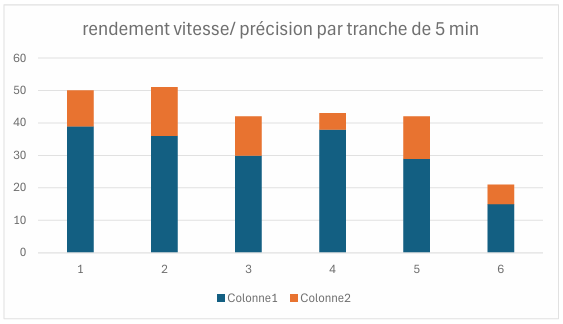
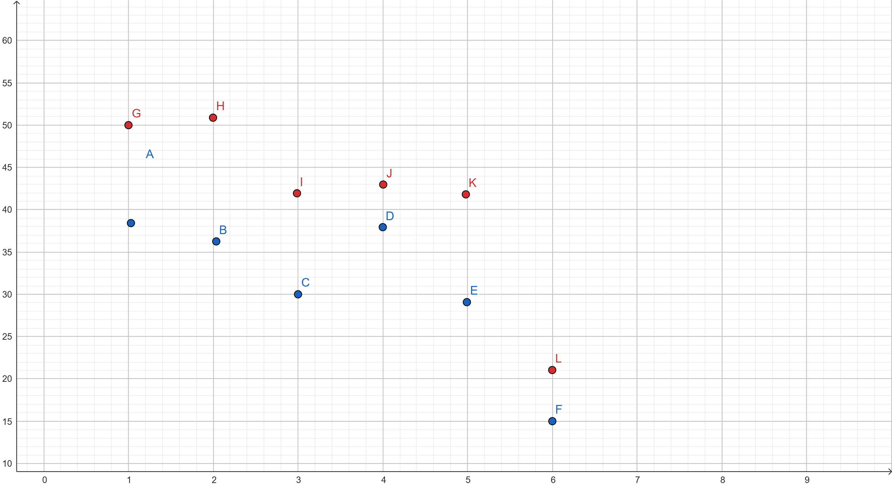

<h6>Pressure is my pleasure</h6>
<h2>Course au contenu</h2>
<pre>Je dispose de 7h, (9h-16h) soit l'&eacute;quivalent d'une journ&eacute;e de travail classique en 35h, pour produire du contenu num&eacute;rique, dans l'optique d'une mise en page sur un double A4.</pre>
<pre>N'ayant pas de sujet pr&eacute;alable &agrave; traiter, je choisis de mesurer ma capacit&eacute; de production de mati&egrave;re textuelle en ce laps de temps donn&eacute;.</pre>
<h2>Dactylo sportive</h2>
<h2>Instructions:</h2>

Par tranche de 5min, je tape le plus de fois possible, et le plus fid&egrave;lement possible, la phrase<strong><em> Pressure is my pleasure</em></strong><em>*</em><em>, </em>en revenant &agrave; la ligne &agrave; chaque it&eacute;ration.

Je tape &agrave; la main, en m&rsquo;interdisant de copier-coller, d&rsquo;effacer, de modifier &agrave; la souris le contenu tap&eacute;.

Je m&rsquo;oblige &agrave; finir de taper la phrase, m&ecirc;me en cas de faute de frappe.

Je prends 5 min de pause entre chaque it&eacute;ration.

Je reproduis 6 fois l&rsquo;it&eacute;ration.

&nbsp;

Entre chaque it&eacute;ration, je r&eacute;alise des tests de vitesse et de pr&eacute;cision sur des sites d&eacute;di&eacute;s.&nbsp;

Je cherche &agrave; maximiser ma performance.

A partir de la deuxi&egrave;me it&eacute;ration, j'&eacute;coute une playlist suppos&eacute;e&nbsp;<em>booster le cardio et am&eacute;liorer la performance sportive.</em>

&nbsp;

<em>Sun Came Up, </em>Sofi Tukker (124 BPM)

<em>Mon cheri,</em> Amadou et Mariam, Sofi Tukker (124 BPM)<em> </em>

<em>My Heart Goes (La Di Da),</em>&nbsp;Becky Hill/ B.O.T.A. (Baddest Of Them All), Eliza Rose, Interplanetary Criminal

<em>La Perla,</em> Sofia Kourtesis (124 BPM)

&nbsp;

*slogan Nike, campagne publicitaire en partenariat avec Kylian Mbapp&eacute;, juin 2024, JO Paris

<h2>Rendement</h2>

Je r&eacute;alise des graphiques (un orthonorm&eacute; et un en colonne) afin de visualiser ma performance.

&nbsp;

&nbsp;

<h2></h2>

fig.1 repr&eacute;sentation graphique en colonne du nombre de phrases tap&eacute;es en 5 min.&nbsp; &nbsp; &nbsp; &nbsp; &nbsp; &nbsp; &nbsp; fig.2&nbsp; &nbsp; &nbsp;

En bleu, les phrases correctes, en orange les phrases incorrectes.&nbsp;

Chaque colonne correspond &agrave; une session de 5 min.&nbsp; &nbsp; &nbsp;

&nbsp;

fig.2 repr&eacute;sentation graphique orthonorm&eacute;e du nombre de phrases tap&eacute;es en 5 min

En bleu, les points ont pour abcsisse l'ordre des sessions (1&egrave;re, 2&egrave;me etc), en ordonn&eacute;e le nombre de phrases correctes tap&eacute;es.

En rouge, les points ont pour abcsisse l'ordre des sessions (1&egrave;re, 2&egrave;me etc), en ordonn&eacute;e le nombre de phrases totales tap&eacute;es.

L'&eacute;cart entre deux points d'une m&ecirc;me abcsisse permet de visualiser la marge d'erreur de frappe.

&nbsp; &nbsp; &nbsp; &nbsp;

<h2>Time's up</h2>

Le challenge n'est pas relev&eacute;: &agrave; 16h, ma mise en page n'est pas finie, et la pression me rend la r&eacute;alisation de la t&acirc;che p&eacute;nible et confuse.

&nbsp;

&nbsp;

&nbsp;

&nbsp;

&nbsp;

&nbsp;

&nbsp;

&nbsp;

&nbsp;
