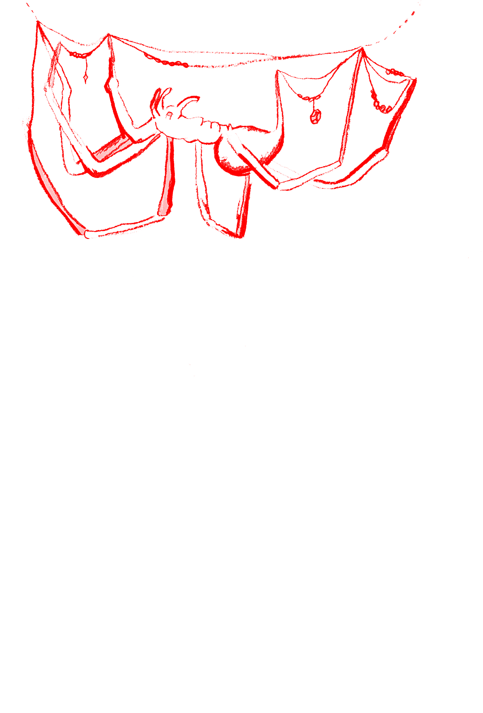
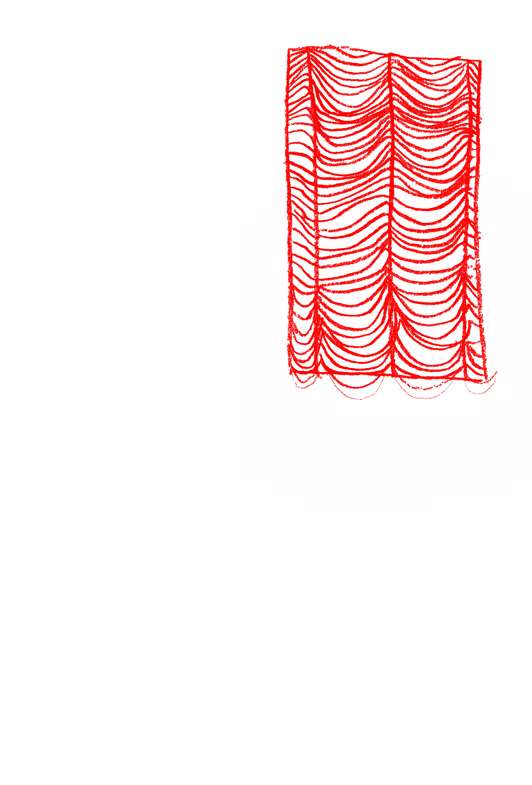
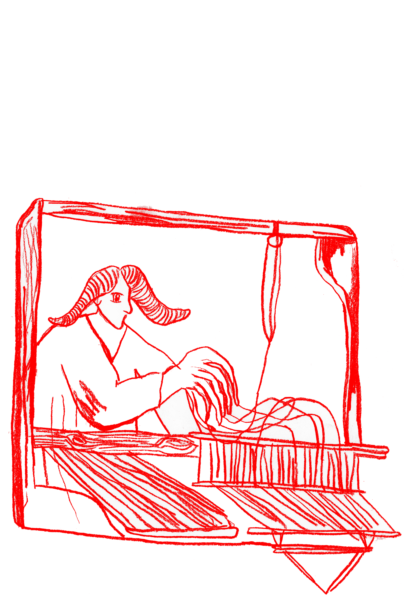
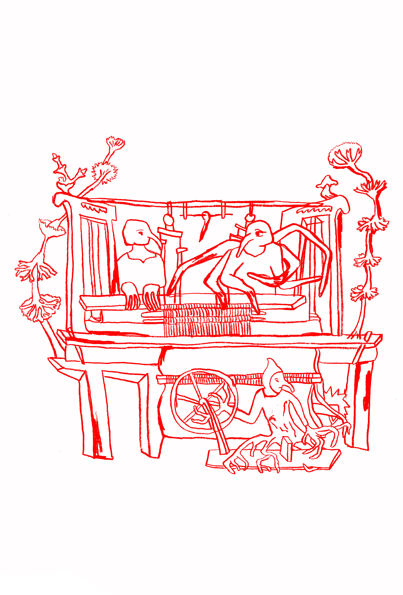
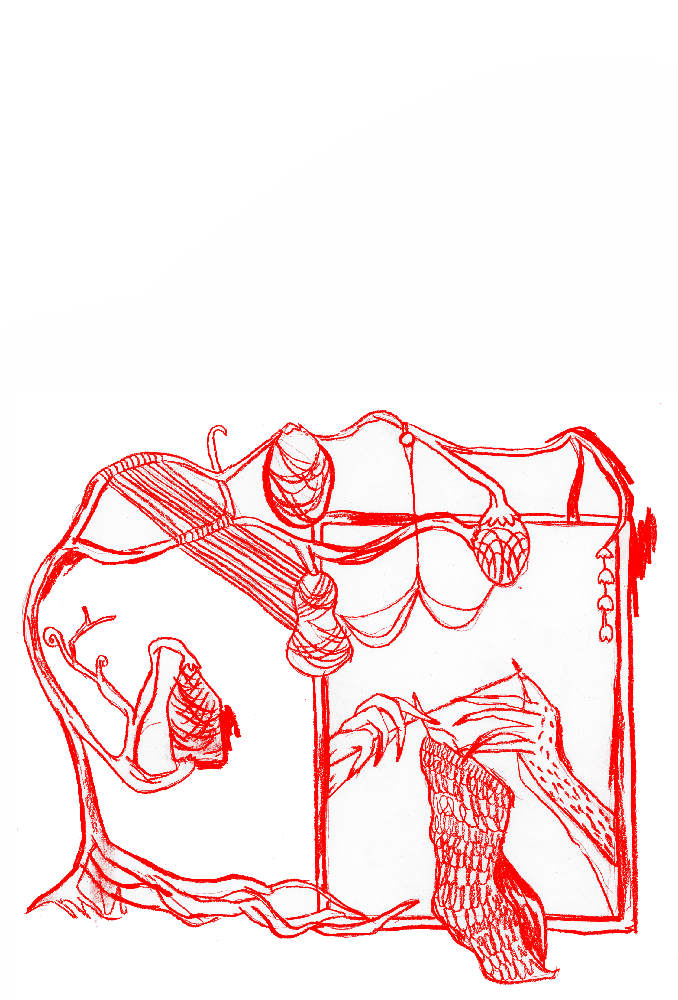
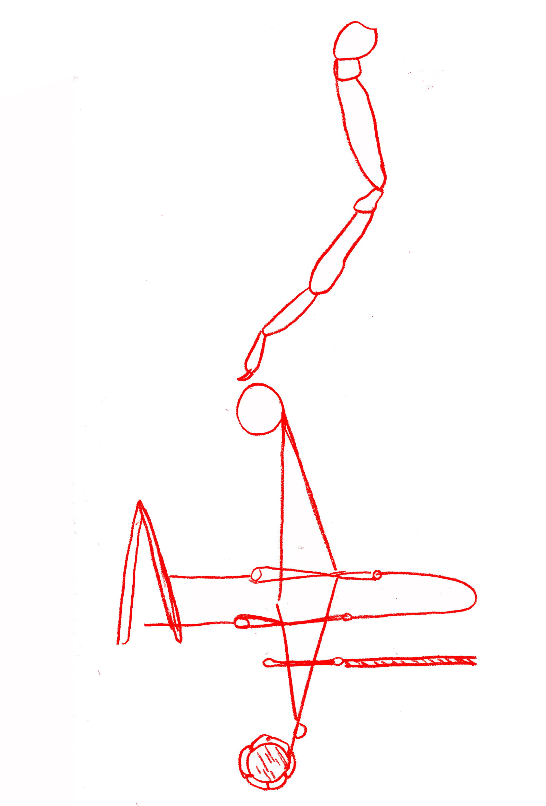
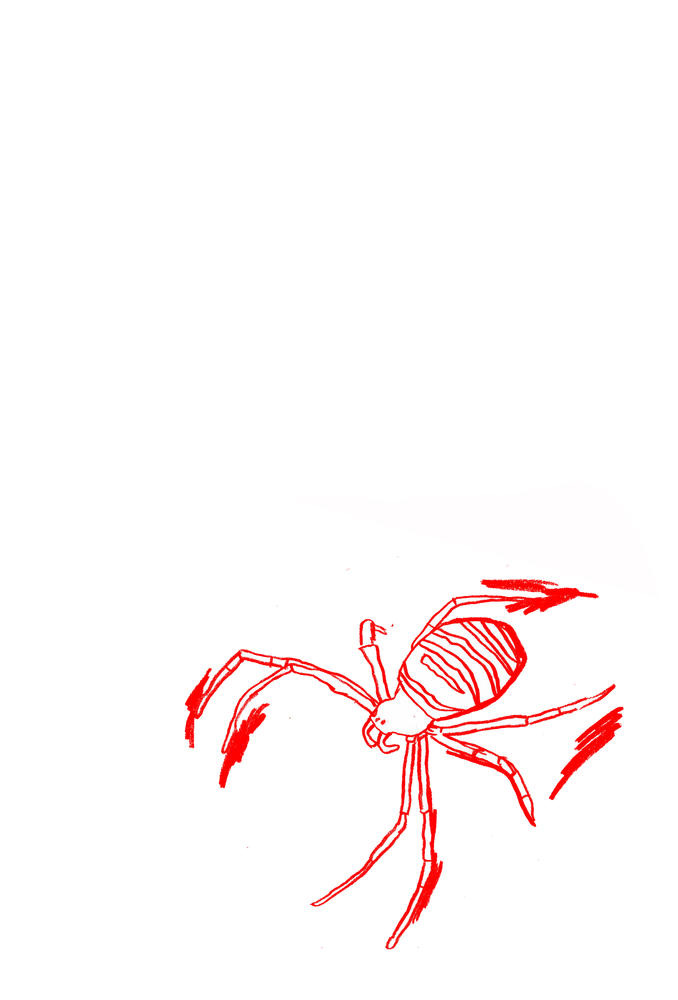

<h2>JE M&Eacute;DITE SUR LA TOILE</h2>

&nbsp;

<h3>JE COMMENCE &Agrave;&nbsp;FAIRE ATTENTION AUX&nbsp;ARAIGN&Eacute;&middot;ES QUI TISSENT LEURS&nbsp;TOILES DANS LES COINS</h3>

&nbsp;

&nbsp;

<h2>LA TOILE</h2>

<blockquote class="text">                             

Ainsi, je parle de la D&eacute;esse comme d&rsquo;une tisserande, une araign&eacute;e, et je commence &agrave; faire attention aux araign&eacute;es qui tissent leurs toiles dans les&nbsp;coins. Je fais l&rsquo;exp&eacute;rience de la toile comme un&nbsp;rythme de fils et d&rsquo;espaces. Je vois qu&rsquo;il y a des n&oelig;uds et des vides, et que le jeu de la mati&egrave;re et de&nbsp;l&rsquo;espace donne &agrave; toute la toile une tension, la rend &agrave; la fois robuste&nbsp;et&nbsp;&eacute;lastique, un ressort.

</blockquote>

&nbsp;

&nbsp;

&nbsp;

<h2>JE M&Eacute;DITE SUR LA TOILE</h2>
<blockquote class="text">    

Je m&eacute;dite sur la toile et c&rsquo;est cette sensation de robustesse que je retiens, que je savoure, que&nbsp;j&rsquo;incorpore jusqu&rsquo;&agrave; &ecirc;tre capable de la rappeler &agrave; volont&eacute;.

</blockquote>

&nbsp;

<h2>JE CHERCHE DANS MA PROPRE VIE CES N&OElig;UDS</h2>
<blockquote class="text">    

Je cherche dans ma propre vie ces&nbsp;n&oelig;uds, ces espaces - dans les mots, dans les relations -, et&nbsp;conna&icirc;tre la sensation de la toile me donne le&nbsp;pouvoir d&rsquo;&ecirc;tre capable de sentir la m&ecirc;me robustesse dans les n&oelig;uds et les espaces de&nbsp;ma vie.

</blockquote>

&nbsp;

<h2>ELLES CONTIENNENT TOUTE LA RICHESSE DE LA R&Eacute;ALIT&Eacute;</h2>
<blockquote class="text">

  Et parce que l&rsquo;araign&eacute;e, la toile sont r&eacute;elles et contiennent toute la richesse de la&nbsp;r&eacute;alit&eacute;, elles peuvent, d&rsquo;autres jours, me donner d&rsquo;autres pouvoirs. En regardant l&rsquo;araign&eacute;e extraire les fils de son propre corps, je peux apprendre &agrave;&nbsp;extraire des cordes d&rsquo;&eacute;nergie de mon propre corps, &agrave; les tisser dans de nouvelles  ; &agrave; extraire des mots de ma t&ecirc;te, de mes mains - pour tisser cette page.   Extrait de R&ecirc;ver l&rsquo;obscur, Starhawk, 1982 p.131

</blockquote>

&nbsp;

&nbsp;

&nbsp;
