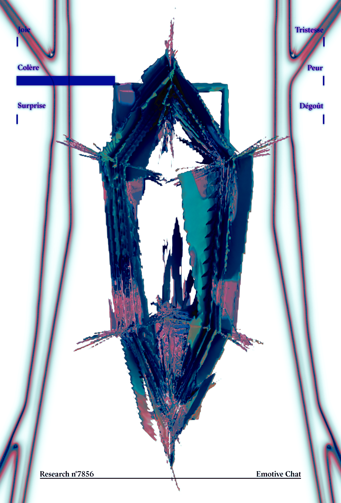
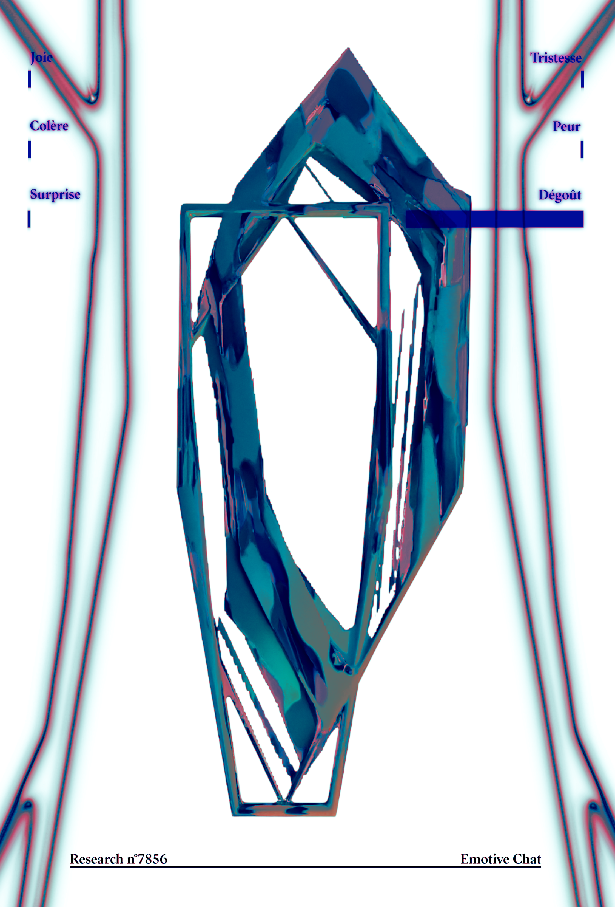
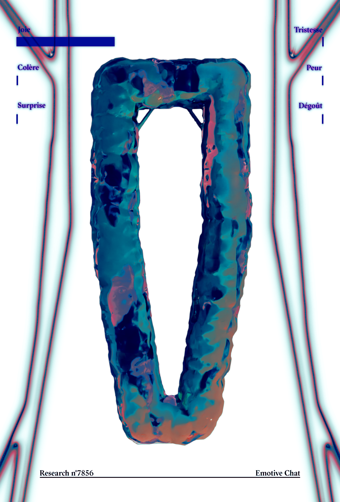
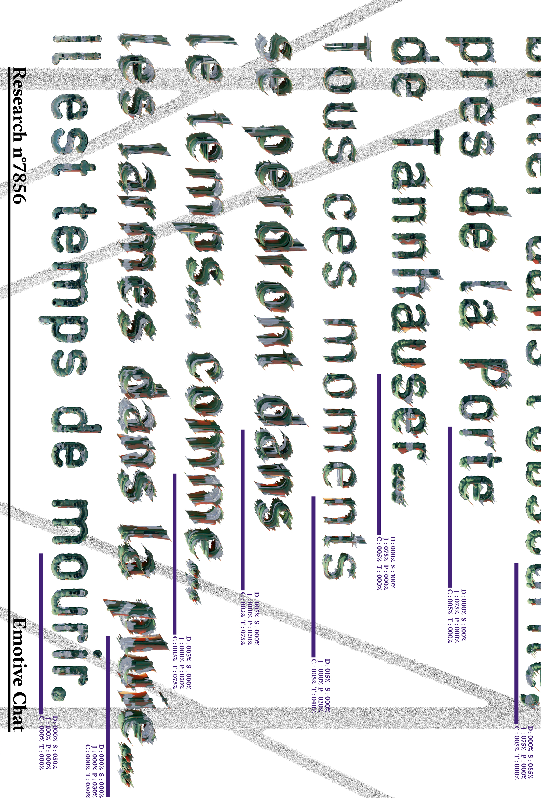
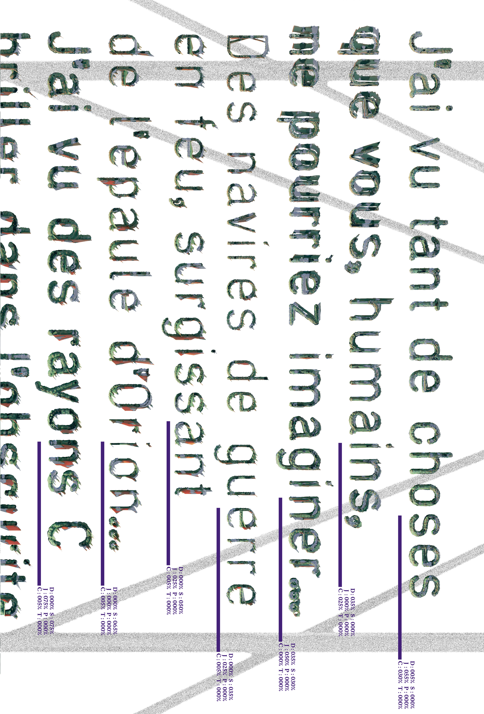
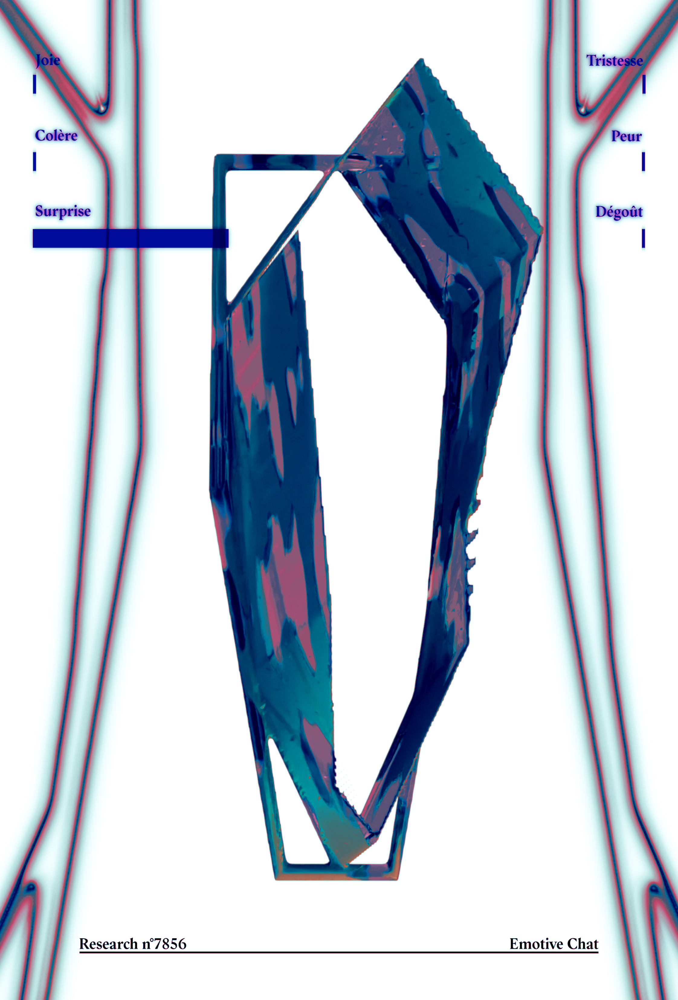
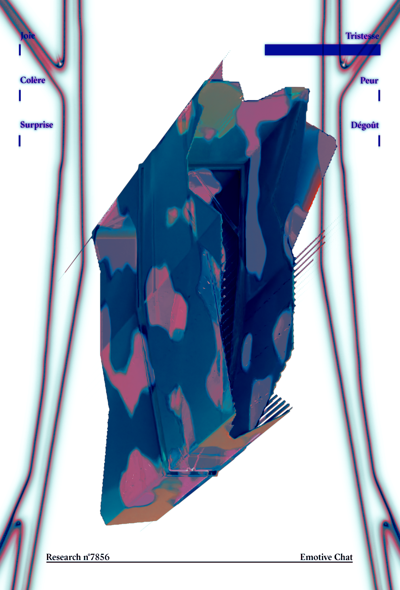

&nbsp;

&nbsp;

<h1>COL&Egrave;RE</h1>
<h2>EMOTIVE CHAT-P3</h2>

&nbsp;

<h3>D&Eacute;GO&Ucirc;T</h3>
<h4>EMOTIVE CHAT-P4</h4>

&nbsp;

<h1>JOIE</h1>
<h2>EMOTIVE CHAT-P5</h2>

&nbsp;

<!-- <h3>MAD BIMBOS: Fast and Fury</h3>
<h4>Emotive Chat</h4> -->

&nbsp;

<!-- <h1>MAD BIMBOS: Fast and Fury</h1>
<h2>Emotive Chat</h2> -->

&nbsp;

<h3>PEUR</h3>
<h4>EMOTIVE CHAT-P8</h4>

&nbsp;

<h1>SURPRISE</h1>
<h2>EMOTIVE CHAT-P9</h2>

&nbsp;

<h3>TRISTESSE</h3>
<h4>EMOTIVE CHAT-P10</h4>

&nbsp;

&nbsp;
