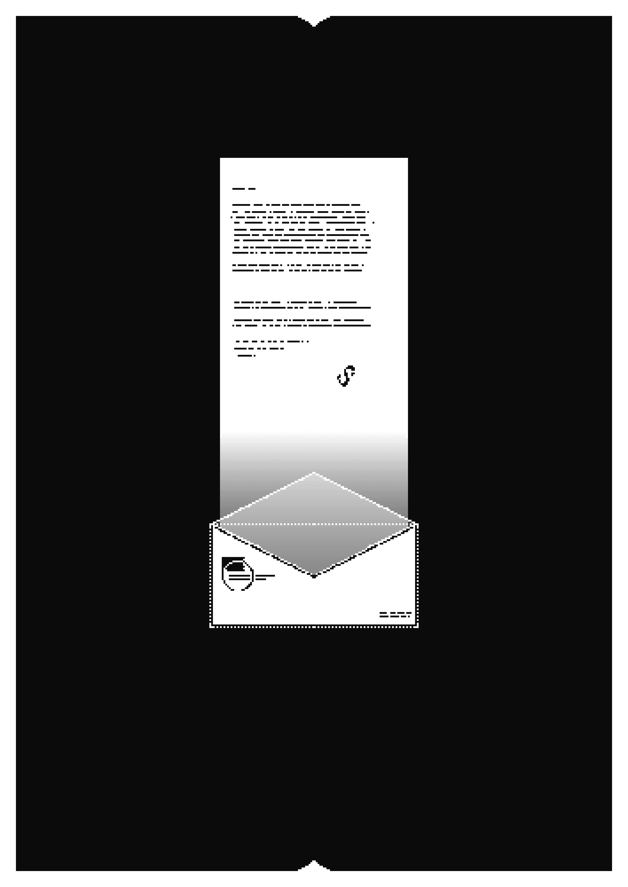

C&eacute;phaloblast, Cordina

&nbsp;

<h1>Lettre de Solveig</h1>
<h2>C&Eacute;PHALOBLAST-P3</h2>

&nbsp;

<h3>Lettre de Solveig</h3>
<h4>C&Eacute;PHALOBLAST-P4</h4>

&nbsp;

<h1>Lettre de Solveig</h1>
<h2>C&Eacute;PHALOBLAST-P5</h2>

16 Flor&eacute;al 246, Cordes-sur-Ciel.

Tr&egrave;s ch&egrave;r&middot;e Hana,   Je t&rsquo;&eacute;cris depuis Cordes o&ugrave; nous pr&eacute;parons notre d&eacute;part pour l&rsquo;Est.   En faisant les paquets, j&rsquo;ai trouv&eacute; mes pages sur l&rsquo;&eacute;pid&eacute;mie. Ce sont des choses que j&rsquo;avais rassembl&eacute;es pendant que &ccedil;a nous est arriv&eacute;. Tout &eacute;tait soigneusement rang&eacute; dans des enveloppes brunes, des&nbsp;articles de presse, des notes, des pages de livre, des tirages... Je les ai relues cette semaine, ann&eacute;e par ann&eacute;e, et en filigrane je pouvais dessiner mes agitations parmi les d&eacute;lires de ce monde.   En traversant tout &ccedil;a j&rsquo;ai eu peur de ressentir trop vite des choses indicibles, je me suis tenue la t&ecirc;te de&nbsp;peur qu&rsquo;elle n&rsquo;&eacute;clate. Quand nous avons fui la baie de Mont-Michel, la digue avait &eacute;clat&eacute;, nous&nbsp;&eacute;tions coinc&eacute;&middot;es dans la vase, et tout s&rsquo;est emball&eacute;, le monast&egrave;re, les s&eacute;cheresses de l&rsquo;Oise, les&nbsp;histoires de&nbsp;Cardiff et ton train pour Oran...   Je crois que nous avons tous&middot;tes &eacute;t&eacute;&middot;es d&eacute;pass&eacute;&middot;es par tout &ccedil;a, et apr&egrave;s quatorze ans je ressens toujours le&nbsp;besoin de sortir la t&ecirc;te de l&rsquo;eau. Est-ce que nous n&rsquo;avons fait que subir ces ann&eacute;es affolantes ?! Les&nbsp;t&ecirc;tes n&rsquo;arr&ecirc;tent pas d&rsquo;exploser sans pr&eacute;venir et je ne m&rsquo;y suis jamais habitu&eacute;e. Malgr&eacute;&nbsp;les&nbsp;proth&egrave;ses, la vue des c&eacute;phaloblast&eacute;&middot;es m&rsquo;&eacute;c&oelig;ure toujours. Je me sens cruelle de te dire &ccedil;a, mais je sais que tu ne me jugeras pas.   Toi, tu avais quoi, seize ans quand &ccedil;a a commenc&eacute; ? Comment tu te souviens de tout &ccedil;a ? J&rsquo;ai toujours pr&eacute;sum&eacute; que tu t&rsquo;y faisais par d&eacute;faut. Mais m&ecirc;me &ccedil;a ?! Je ne comprends toujours pas pourquoi on&nbsp;ne&nbsp;meurt pas sur le coup apr&egrave;s un truc pareil. Peut-&ecirc;tre que je ne vaux pas mieux que ces fadas qui les&nbsp;brutalisent. Apr&egrave;s tout, ni moi, ni eux ne les comprenons.   Je sais qu&rsquo;en reprenant contact, l&rsquo;usage voudrait que je te fasse un compte rendu complet de ma situation comme quoi tout va bien etc... Mais cette page est bien &eacute;troite et ma confession trop furtive, si je ne l&rsquo;&eacute;cris pas ce soir, je nierai ces sentiments demain, jusqu&rsquo;&agrave; ce qu&rsquo;ils reviennent un jour de fragilit&eacute;.   J&rsquo;esp&egrave;re que tu me pardonneras ce message unilat&eacute;ral, bien que je n&rsquo;ai pas les id&eacute;es claires je&nbsp;me&nbsp;souviens que tu n&rsquo;ouvres ton courrier que si le c&oelig;ur t&rsquo;en dis.   Je t&rsquo;embrasse chaleureusement.

&nbsp;

<h3>LA D&Eacute;P&Ecirc;CHE</h3>
<h4>C&Eacute;PHALOBLAST-P6</h4>

Cela fait un an, jour pour jour. La premi&egrave;re c&eacute;phaloblast&eacute;, trait&eacute;e entre ces pages comme un fait divers isol&eacute;. Si&acirc;m&nbsp;Garland, &eacute;tudiant&middot;e en lettre de 25&nbsp;ans r&eacute;pand sa cervelle dans une sup&eacute;rette de&nbsp;Mont-Michel un jour de grande affluence. Encore debout, il est saisi par la s&eacute;curit&eacute; et re&ccedil;oit une&nbsp;amende par le Minist&egrave;re de la Paix Civile.   Derni&egrave;rement intern&eacute; &agrave; la clinique de Granville, le patient 0 a&nbsp;&eacute;t&eacute; plac&eacute; sous la protection Inter- Minist&eacute;rielle. Sa r&eacute;sidence et son &eacute;tat sont encore inconnus malgr&eacute; les manifestations agit&eacute;es de&nbsp;l&rsquo;&Eacute;glise de la Nouvelle Gnose, les d&eacute;fil&eacute;s Miliciens ou&nbsp;les&nbsp;requ&ecirc;tes des historien&middot;nes de l&rsquo;&eacute;pid&eacute;mie.   En une semaine, ce sont 256 &eacute;clatements de cr&acirc;nes d&eacute;clar&eacute;s sur&nbsp;le&nbsp;continent. L&rsquo;alerte de l&rsquo;&eacute;pid&eacute;mie retentit et devient vite une&nbsp;priorit&eacute; minist&eacute;rielle. Un premier congr&egrave;s m&eacute;dical est r&eacute;uni le 25&nbsp;Frimaire&nbsp;230 et le terme c&eacute;phaloblast&eacute; est n&eacute;. Ce sont les&nbsp;absences des patient&middot;es qui inqui&egrave;tent le plus le corps m&eacute;dical. Avant&nbsp;que les&nbsp;proth&egrave;ses soient d&eacute;ploy&eacute;es, les corps de c&eacute;phalo-blast&eacute;&middot;es se&nbsp;d&eacute;sincarnent pendant quelques heures, quelques jours, parfois des semaines. Alors cliniquement morts, ces corps doivent &ecirc;tre maintenus dans des chambres st&eacute;riles en attendant que les patient&middot;es se r&eacute;animent.   Mais l&rsquo;&eacute;pid&eacute;mie ne ralentit pas et les accidents li&eacute;s aux absences et aux c&eacute;phaloblast&eacute;&middot;es se multiplient, l&rsquo;opinion publique se&nbsp;d&eacute;grade. Des soul&egrave;vements pressent le Minist&egrave;re d&rsquo;endiguer l&rsquo;&eacute;pid&eacute;mie au plus vite.   Le 7 Niv&ocirc;se 230, des manifestations ont lieu devant les antennes minist&eacute;rielles de Prague, de Berlin, de Marseille et de Londres. Les foules sont historiquement &eacute;lev&eacute;es, estim&eacute;es &agrave; un total de&nbsp;8&nbsp;millions de manifestant&middot;es et forces de l&rsquo;ordre. Elles sont en proies &agrave; la plus grande c&eacute;phaloblast&eacute; &agrave; ce jour.  Comme une r&eacute;action en cha&icirc;ne, ce sont des dizaines de milliers de cr&acirc;nes qui &eacute;clatent conjointement. Aujourd&rsquo;hui on estime le&nbsp;nombre de victimes &agrave; 59 000 dont 12 000&nbsp;morts.  La loi martiale est appliqu&eacute;e &agrave; 20 :30, les foules dissip&eacute;es et prohib&eacute;es &agrave; ce jour. Le choc est toujours grand et le 7 Niv&ocirc;se est d&eacute;clar&eacute; f&eacute;ri&eacute; sur tout le continent.   Sur toutes les radios europ&eacute;ennes, &agrave; 23 :00 Madame la&nbsp;Ministre de la Paix, Sigrid Schr&ouml;dinger, prend la&nbsp;parole, annonce les&nbsp;modalit&eacute;s de la loi Martial, couvre-feu, continentalisation de&nbsp;grandes firmes m&eacute;dicales et cliniques, et restructuration des&nbsp;h&ocirc;pitaux et d&eacute;ploiement d&rsquo;h&ocirc;pitaux mobiles. Les&nbsp;&eacute;tudiant&middot;es en m&eacute;decine sont mobilis&eacute;&middot;es et un appel aux citoyen&middot;nes est fait pour devenir infirmier&middot;es volontaires.   Une semaine plus tard apparaissent les premi&egrave;res proth&egrave;ses en c&eacute;ramique du docteur Yasmina El-Hamin, elles sont distribu&eacute;es d&rsquo;office &agrave; chaque prise en charge pour c&eacute;phaloblast&eacute;.   Pendant un mois, c&rsquo;est dans un silence continental pesant que l&rsquo;on attend si les chiffres de cephaloblast&eacute; baissent. En v&eacute;rit&eacute;, l&rsquo;&eacute;pid&eacute;mie se stabilise lentement &agrave; 3,7 cas par heure.   Le 20 Vent&ocirc;se 230 le docteur Yasmina El-Hamin prend la&nbsp;t&ecirc;te du&nbsp;nouveau Minist&egrave;re de l&rsquo;&Eacute;pid&eacute;mie, centralis&eacute; &agrave; Prague en l&rsquo;honneur du succ&egrave;s de ses proth&egrave;ses et de leur d&eacute;ploiement g&eacute;r&eacute; par son nouvel adjoint, Avrilius Zenon, jusqu&rsquo;alors secr&eacute;taire du&nbsp;Minist&egrave;re de la Sant&eacute;.   L&rsquo;Europe est plac&eacute;e en quarantaine depuis l&rsquo;installation de la loi martiale. Le commerce international est suspendu. Les &eacute;conomies se r&eacute;&eacute;crivent et l&rsquo;Inter-Minist&eacute;rielle organise et r&eacute;gule les&nbsp;richesses et les contacts ext&eacute;rieurs. Nous ne pouvons pas confirmer les rumeurs de c&eacute;phaloblast&eacute; sur les autres continents sans un communiqu&eacute; Minist&eacute;riel.   Aucun &agrave; ce jour.

&nbsp;

<h5>CONSEIL C&Eacute;PHALOBLAST</h5>
<h6>C&Eacute;PHALOBLAST-P7</h6>

Nous sommes &agrave; Mont-Michel depuis le soir du 16&nbsp;Germinal&nbsp;233 et nous sommes 77&nbsp;c&eacute;phaloblast&eacute;&middot;es. Certain&middot;es d&rsquo;entre nous n&rsquo;ont pas parl&eacute; depuis leur &eacute;clatement. Beaucoup ont &eacute;gar&eacute; leurs noms. Ce sont les explosions spontan&eacute;es de nos cr&acirc;nes qui nous ont rassembl&eacute;&middot;es ici, personne parmi nous ne pr&eacute;tend expliquer pourquoi. Nous nous souvenons tous&middot;tes avoir &eacute;t&eacute; terrifi&eacute;&middot;es &agrave; l&rsquo;id&eacute;e de sortir, &agrave; quitter nos corps trop distrait&middot;es par les multitudes qui entourent notre petit monde.   En une ann&eacute;e d&rsquo;apparition nous avons re&ccedil;u de la part des&nbsp;administrations, des maisons d&rsquo;&eacute;ditions et des parleur&middot;euses les appellations que l&rsquo;on colle &agrave; cell&middot;eux dont l&rsquo;existence embarrasse. En 230, lors des premiers jours, nous &eacute;tions des criminel&middot;les qui devaient craindre l&rsquo;amende pour avoir eu le malheur de se montrer. Les&nbsp;m&ecirc;mes visages qui nous mena&ccedil;aient d&rsquo;amendes nous ont vu&middot;es comme des patient&middot;es &agrave; qui donner des&nbsp;proth&egrave;ses en c&eacute;ramique et des baumes pour dissimuler nos plaies.   Nous sommes apparu&middot;es dans une panique collective. Une&nbsp;crainte de la masse des autres. La n&ocirc;tre s&rsquo;est &eacute;chapp&eacute;e de nous avec la chair de nos t&ecirc;tes. Nous&nbsp;sommes devenu&middot;es une urgence qui ne s&rsquo;arr&ecirc;te pas de grandir, et qui n&rsquo;a, apparemment, pas choisi les jours les plus opportuns pour se manifester. Pour nous, juste apr&egrave;s l&rsquo;&eacute;clatement, est venue la sid&eacute;ration. Les mots que portent le r&eacute;el se sont r&eacute;v&eacute;l&eacute;s &ecirc;tre des &eacute;tuis contradictoires, fragilement pos&eacute;s l&agrave; pour nous &eacute;viter une fascination perp&eacute;tuelle. De&nbsp;celle- ci nous sommes nombreux&middot;ses &agrave; ne pas en &ecirc;tre revenu&middot;es. Nous vous avons dit plus t&ocirc;t que nous &eacute;tions 77&nbsp;c&eacute;phaloblast&eacute;&middot;es ici, nous sommes 77&nbsp;corps encore battants, mais il y a tr&egrave;s certainement dans l&rsquo;air des&nbsp;poign&eacute;es de t&eacute;moignant&middot;es absorb&eacute;&middot;es par les plus infimes parcelles de r&eacute;el.  La m&eacute;decine du Minist&egrave;re appelle &ccedil;a les absences. Les&nbsp;fois o&ugrave; nous sommes distrait&middot;es par les &eacute;v&egrave;nements incessants qui peuplent l&rsquo;invisible. Il y cell&middot;eux qui nous croient mourir, d&rsquo;autres nous racontent que nous sommes transcend&eacute;&middot;es. Dans des tracts, les&nbsp;&Eacute;glises nous annoncent, nous proph&eacute;tisent et jouissent du spectacle de notre arriv&eacute;e. Les pr&ecirc;cheurs de&nbsp;presse ont trouv&eacute; en nous de quoi terrifier cell&middot;eux qu&rsquo;ils veulent distraire des manquements de notre &eacute;poque.   Aujourd&rsquo;hui, bien que conscient&middot;es des limites des mots, nous dressons enfin une repr&eacute;sentation qui ne vient pas de vous.   - Nous ne sommes ni morts, ni proh&egrave;tes&middot;ses ; ni maladies, ni dangers.   - Nous ne sommes d&rsquo;aucune augure, ni d&rsquo;aucune nouveaut&eacute;.   - Nous n&rsquo;oublions pas qui nous sommes, mais nous savons ce que nous devenons.   - Nous sommes entre votre nez et cette page.   - Nous nous mettons &agrave; l&rsquo;abri dans les immensit&eacute;s de ce&nbsp;que beaucoup ne per&ccedil;oivent plus.   - Nous ouvrons notre t&ecirc;te et nous constatons chaque nuit un peu de ce qui nous &eacute;chappe.   - Comme les vers dig&egrave;rent le sol, nous sirotons l&rsquo;ind&eacute;passable.   - Nous partageons vos fatigues et vos faiblesses.

&nbsp;

<h3>GUIDE M&Eacute;DICAL</h3>
<h4>C&Eacute;PHALOBLAST-P8</h4>
<!-- 

La céphaloblasté est la première condition métaphysique décrite en Frimaire 230 lors du&nbsp;Congrès Médical
de Dansk. Elle se caractérise par une explosion spontanée et non létale du crâne, bien que les patient·es
perdent la vue et l’ouïe, iels manifestent une conscience accrue de leur entourage. La première cause de
mortalité des céphalo-blasté·es est liée à l’absence, démontrée par le docteur Victor Hesse. Il s’agit d’un
état de&nbsp;mort clinique dans lequel plongent les céphaloblasté·es pendant plusieurs jours déclenchant les
premiers mécanismes de décompositions, après deux ou trois jours, leur corps entre en putréfaction s’il
n’est pas maintenu, le retour du patient dans son corps est souvent bref, les fonctions vitales ne pouvant
être assurées par des&nbsp;tissus décomposés.

 -->

La c&eacute;phaloblast&eacute; est la premi&egrave;re condition m&eacute;taphysique d&eacute;crite en Frimaire 230 lors du&nbsp;Congr&egrave;s M&eacute;dical de&nbsp;Dansk. Elle se caract&eacute;rise par une explosion spontan&eacute;e et non l&eacute;tale du cr&acirc;ne, bien que les patient&middot;es perdent la&nbsp;vue et l&rsquo;ou&iuml;e, iels manifestent une conscience accrue de leur entourage. La premi&egrave;re cause de mortalit&eacute; des&nbsp;c&eacute;phalo-blast&eacute;&middot;es est li&eacute;e &agrave; l&rsquo;absence, d&eacute;montr&eacute;e par le docteur Victor Hesse. Il s&rsquo;agit d&rsquo;un &eacute;tat de&nbsp;mort clinique dans lequel plongent les c&eacute;phaloblast&eacute;&middot;es pendant plusieurs jours d&eacute;clenchant les premiers m&eacute;canismes de&nbsp;d&eacute;compositions, apr&egrave;s deux ou trois jours, leur corps entre en putr&eacute;faction s&rsquo;il n&rsquo;est pas maintenu, le retour du&nbsp;patient dans son corps est souvent bref, les fonctions vitales ne pouvant &ecirc;tre assur&eacute;es par des&nbsp;tissus d&eacute;compos&eacute;s.   Gr&acirc;ce aux observations et aux descriptions du docteur Hesse, en maintenant les absent&middot;es dans un coma en milieu st&eacute;rile, il est possible de voir le retour de certain&middot;es patient&middot;es jusqu&rsquo;&agrave; 36 jours (voir le cas d&rsquo;Elica Ophid&eacute;). Bien que cela limite les d&eacute;c&egrave;s, il est commun que les c&eacute;phaloblast&eacute;&middot;es aient de s&eacute;v&egrave;res complications de sant&eacute; dues &agrave; leurs absences. Ces derni&egrave;res sont tr&egrave;s vari&eacute;es: difficult&eacute;s motrices, cognitives, sympt&ocirc;mes post-traumatiques, maladies auto-immunes, n&eacute;croses, allergies, troubles digestifs, atrophie du foie, dysfonctionnements r&eacute;naux...   L&rsquo;hypoth&egrave;se psychologique :  Popularis&eacute;e par la Ministre El-Hamin, l&rsquo;hypoth&egrave;se psychologique &eacute;met que les c&eacute;phaloblast&eacute;&middot;es sont corr&eacute;l&eacute;es &agrave; un&nbsp;malaise psychologique profond. Une d&eacute;&middot;personalisation&middot;r&eacute;alisation brutale li&eacute;e &agrave; une&nbsp;instabilit&eacute; sociale et morale souvent d&eacute;crite par les patient&middot;es r&eacute;c&eacute;dant l&rsquo;&eacute;clatement. C&rsquo;est cet &eacute;tat de crise de&nbsp;l&rsquo;existence qui a ouvert la cat&eacute;gorie des pathologies m&eacute;taphysiques. Utilis&eacute;e pour la pr&eacute;vention, l&rsquo;hypoth&egrave;se El-Hamin ne permet pas d&rsquo;identifier le&nbsp;ph&eacute;nom&egrave;ne m&eacute;canique de&nbsp;la c&eacute;phaloblast&eacute;.   L&rsquo;hypoth&egrave;se gnostique :  Pr&ocirc;n&eacute;e par la m&eacute;decine de l&rsquo;&Eacute;glise de la Nouvelle Gnose. Cette hypoth&egrave;se, au statut pol&eacute;mique, &eacute;met des&nbsp;postulats m&eacute;taphysiques inv&eacute;rifiables. Pour les gnostiques, c&rsquo;est une substance spirituelle qui s&rsquo;&eacute;cha-ppe du cr&acirc;ne, d&rsquo;apr&egrave;s ell&middot;eux c&rsquo;est une lib&eacute;ration des biais corporels, ce serait cette substance globalisant les&nbsp;perceptions qui s&rsquo;&eacute;chappe du&nbsp;corps et dont le voyage provoque l&rsquo;absence. Bien que l&rsquo;explication n&eacute;o-gnostique valide le fonctionnement de la&nbsp;proth&egrave;se El-Hamin, contenant la substance spirituelle, le&nbsp;Minist&egrave;re s&rsquo;oppose &agrave; son enseignement dans les structures publiques pour manque de v&eacute;rifiabilit&eacute;.   L&rsquo;hypoth&egrave;se Hyphique :  Hypoth&egrave;se crois&eacute;e des universit&eacute;s de neurologie et de philosophie de Berlin publi&eacute;e en Germinal 234, en r&eacute;action &agrave;&nbsp;la popularit&eacute; des th&eacute;ories gnostiques, elle est la premi&egrave;re r&eacute;dig&eacute;e avec des c&eacute;phaloblast&eacute;&middot;es. Selon cette hypoth&egrave;se, l&rsquo;&eacute;clatement du cr&acirc;ne et l&rsquo;&eacute;largissement perceptif ne sont pas li&eacute;s &agrave; un d&eacute;placement de substance de l&rsquo;int&eacute;rieur vers l&rsquo;ext&eacute;rieur mais plut&ocirc;t &agrave; un abattement des fronti&egrave;res qui les s&eacute;parent. Plus pr&eacute;cis&eacute;ment &agrave; une dissolution des tissus neuronaux dans l&rsquo;atmosph&egrave;re communiquant encore avec les r&eacute;sidus c&eacute;r&eacute;braux du corps.Selon cette hypoth&egrave;se, les&nbsp;corps des c&eacute;phaloblast&eacute;&middot;es absent&middot;es ne sont pas totalement sans vie, supposant une activit&eacute; tr&egrave;s l&eacute;g&egrave;re de l&rsquo;arbre de vie et de l&rsquo;hypophyse. L&rsquo;&eacute;parpillement neuronal est apparent&eacute; &agrave; l&rsquo;hyphe, le r&eacute;seau unicellulaire des champignons observ&eacute; notamment dans les&nbsp;sols forestiers. Cette hypoth&egrave;se, en attente de v&eacute;rification clinique, est au c&oelig;ur des&nbsp;enthousiasmes m&eacute;dicaux.

&nbsp;

<h5>LA D&Eacute;P&Ecirc;CHE</h5>
<h6>C&Eacute;PHALOBLAST-P9</h6>

Records de temp&eacute;rature pour la d&eacute;cade du 1er au 11 Thermidor. Une canicule grave qui est venue s&rsquo;ajouter et amplifier les graves &eacute;v&egrave;nements du d&eacute;but de ce mois.   Le 3 Thermidor, 12 :34, le m&eacute;tropolitain central de Cardiff s&rsquo;embrase, une premi&egrave;re d&eacute;flagration provoque un &eacute;croulement sous la gare ferroviaire. Elle fait 350 bless&eacute;s, 124 morts et une vingtaine de c&eacute;phaloblast&eacute;. Le r&eacute;seau est arr&ecirc;t&eacute; et les foules en panique sont dispers&eacute;es par les forces de l&rsquo;ordre craignant une&nbsp;nouvelle c&eacute;phaloblast&eacute; de masse. Dans la demi-heure, &agrave;&nbsp;13 :37 une seconde explosion &eacute;croule la cath&eacute;drale et la voix de&nbsp;l&rsquo;&eacute;v&ecirc;que n&eacute;ognostique Monsieur Fr&eacute;deric Kjeld retentit dans toutes les&nbsp;t&ecirc;tes.   &laquo; Des cendres du choc, jailliront les ailes de la V&eacute;rit&eacute;, sortez de la&nbsp;confusion et rejoignez-moi dans l&rsquo;&eacute;ternit&eacute; qui vous attend hors de&nbsp;votre cr&acirc;ne ! &raquo;   Presque deux mille cas de c&eacute;phaloblast&eacute; retentissent dans la ville dans les heures qui suivent alors que les forces de l&rsquo;ordre con-finent et fouillent toutes les maisons. Revendiquant les attentats, l&rsquo;&eacute;v&ecirc;que a fait parvenir aux agences de Presse des lettres que nous ne publierons pas pour des raisons de sant&eacute; publique. Un&nbsp;avis de&nbsp;recherche est relay&eacute; partout dans le continent.   Pour endiguer le choc de la&nbsp;nouvelle, l&rsquo;&Icirc;le Britannique est plac&eacute;e sous quarantaine, le premier ministre E.Cooper annonce l&rsquo;&eacute;v&egrave;nement tragique et le d&eacute;ploiement des cellules psychologiques dans chaque comt&eacute;.   Le 4 Thermidor, les m&eacute;dias re&ccedil;oivent l&rsquo;autorisation de partager la&nbsp;nouvelle &agrave; la suite de la capture de l&rsquo;&eacute;v&ecirc;que F.Kjeld ainsi que la&nbsp;fin des cycles d&rsquo;&eacute;clatement. L&rsquo;Interminist&eacute;riel renforce la loi martiale et officialise l&rsquo;interdiction de l&rsquo;&Eacute;glise de la Nouvelle Gnose, les&nbsp;&eacute;v&ecirc;ques se d&eacute;solidarisant de l&rsquo;attentat de Cardiff sont&nbsp;pri&eacute;s de&nbsp;se&nbsp;rendre aux autorit&eacute;s, pour signer un acte  d&rsquo;auto-excommunication.  Le 5 Thermidor une marche comm&eacute;morative est organis&eacute;e par la&nbsp;municipalit&eacute; de Cardiff. Pose de cierges, cercles de paroles, et concerts spontan&eacute;s sont encadr&eacute;s dans la ville et sont annonc&eacute;s sur 4 jours.   Le 6 Thermidor, une marche milicienne met fin aux comm&eacute;morations. Des cort&egrave;ges arm&eacute;s d&rsquo;armes de fortunes, visent les&nbsp;c&eacute;pha-loblast&eacute;&middot;es. Quatorze victimes de violences miliciennes sont &agrave; d&eacute;plorer, l&rsquo;intervention des forces de l&rsquo;ordre est limit&eacute;e. La&nbsp;pr&eacute;fecture de police communique : &laquo; Nous condamnons les&nbsp;violences inacceptables de ces groupes, nous regrettons les&nbsp;marches du 6 Thermidor. Nous avons conscience de nos interventions limit&eacute;es et offrons tout notre soutien aux familles et aux proches des victimes. Cependant, nous ne pouvions risquer une escalade des affrontement de peur de revoir trop t&ocirc;t les &eacute;v&egrave;nements du 1er Thermidor se r&eacute;p&eacute;ter. Des sanctions seront ass&eacute;n&eacute;es aux coupables &raquo;   Le 8 Thermidor. Les violences miliciennes se propagent sur le&nbsp;continent malgr&eacute; un embargo m&eacute;diatique minist&eacute;riel.   Le 10 Thermidor, les fid&egrave;les de la nouvelle Gnose protestent contre les &eacute;v&ecirc;ch&eacute;s de Cardiff, Rome, Jacques de Compostelle et Istanbul. Des graffitis appelant &agrave; un nouveau Schisme religieux recouvrent les anciens lieux de culte. Le Minist&egrave;re de la&nbsp;Paix annonce avoir d&eacute;jou&eacute; quatre attentats miliciens.   Aujourd&rsquo;hui les crises religieuses et politiques font presque oublier le choc des attentats du premier Thermidor. Le seul consensus exprim&eacute; r&eacute;side dans l&rsquo;espoir d&rsquo;une r&eacute;solution d&eacute;mocratique. L&rsquo;InterMinist&eacute;riel s&rsquo;exprimera ce soir dans les radios localis&eacute;es pour &eacute;tablir les conditions de cette r&eacute;solution.

&nbsp;

<h3>LETTRE D&rsquo;HANNA</h3>
<h4>C&Eacute;PHALOBLAST-P10</h4>

16 Messidor 246, Oran

Tu me l&rsquo;as d&eacute;j&agrave; dit et &eacute;crit tant de fois pourtant, <em>ta confusion n&rsquo;est pas un d&eacute;faut</em>. Cela doit faire partie de ces choses que tu sais dire mais que t&rsquo;autorise pas &agrave; croire &agrave; ton propos. Tu partage ce trait autant que ta confusion avec chacun&middot;e d&rsquo;entre nous. Je ne connais, pourtant, pas tant de gens qui s&rsquo;acharnent &agrave; l&rsquo;exprimer. Tu peut en &ecirc;tre fi&egrave;re   Dis toi que ta lettre m&rsquo;est parvenue le mois dernier par un Greffier-du-Minist&egrave;re. D&eacute;j&agrave; c&rsquo;est un &eacute;v&egrave;nement entier de se faire alpaguer par un uniforme, mais le gonz avait une t&ecirc;te de crapaud. Gluante, la&nbsp;gueule large comme une soupi&egrave;re qui d&eacute;passait, sans contraindre, de son petit col. Des proth&egrave;ses animales para&icirc;t-on. Je ne sais toujours pas s &rsquo;il a fusionn&eacute; avec un t&ecirc;tard ou si des c&eacute;phaloblast&eacute;&middot;es d&eacute;miurges ont appris la greffe inter-esp&egrave;ce.   J&rsquo;aurais jamais imagin&eacute; respirer l&rsquo;haleine d&rsquo;une chim&egrave;re pareille, mais je n&rsquo;arrive plus &agrave; m&rsquo;en &eacute;tonner avec la gravit&eacute; que tu appuie dans ta lettre. C&rsquo;est plus facile de trouver &ccedil;a dr&ocirc;le.   Par piti&eacute; pour toi-m&ecirc;me ne te range pas avec les miliciens. Ne pas comprendre n&rsquo;est pas une faute, mais refuser de le faire est la leur. &Agrave; vrai dire, je ne crois pas que tu ais besoin d&rsquo;explications pour accepter ce qu&rsquo;il se passe.   Je te le disais en face et je te le redis par lettre: ne cherche plus &agrave; faire taire l&rsquo;angoisse. Tu peux &eacute;prouver tout &ccedil;a, et avec la m&ecirc;me compassion que tu sais offrir &agrave; tes proches. Je te souhaite de&nbsp;trouver le temps et le courage de traverser un peu le silence des murs.   Bon sang, tu m&rsquo;as manqu&eacute;e tu sais, je te remercie de m&rsquo;avoir ouvert &agrave; nouveau ta belle d&eacute;tresse.   J&rsquo;ai moi aussi une collection de pages de l&rsquo;&eacute;poque, m&ecirc;me &agrave; seize ans on sait reconna&icirc;tre un document &agrave; archiver. Malheureusement je n&rsquo;ai jamais eu ta discipline, les miens sont &eacute;parpill&eacute;s dans la maison. J&rsquo;ai la page du conseil m&eacute;dical dans les toilettes.   Je ch&eacute;ri l&rsquo;id&eacute;e de nos retrouvails, chacune de tes lettres est une friandise.   Tu as toute notre affection ici, prends ton soin.

&nbsp;

&nbsp;
