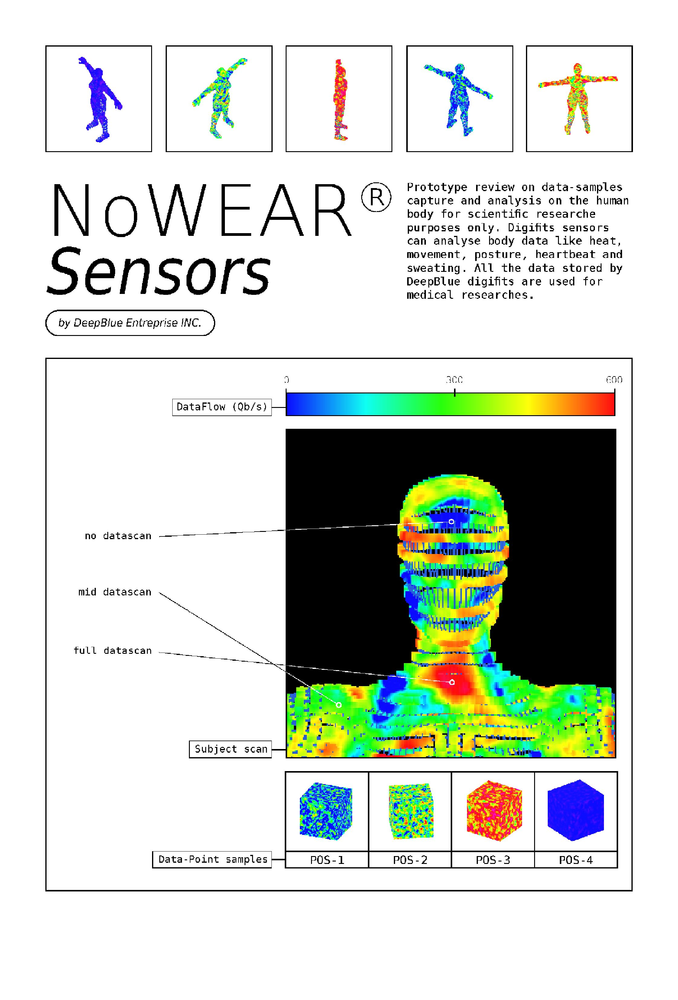
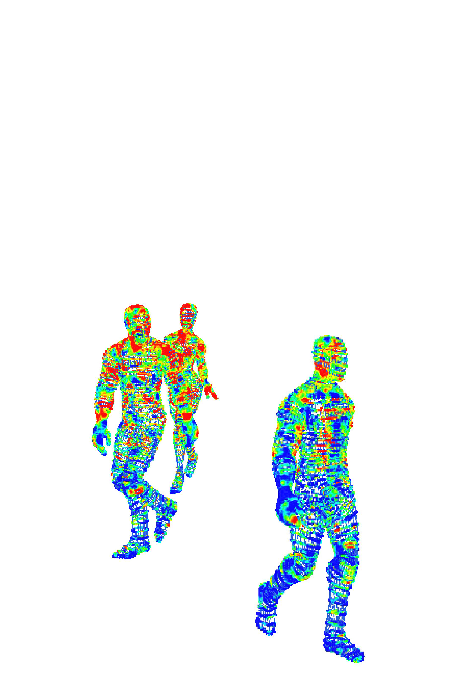
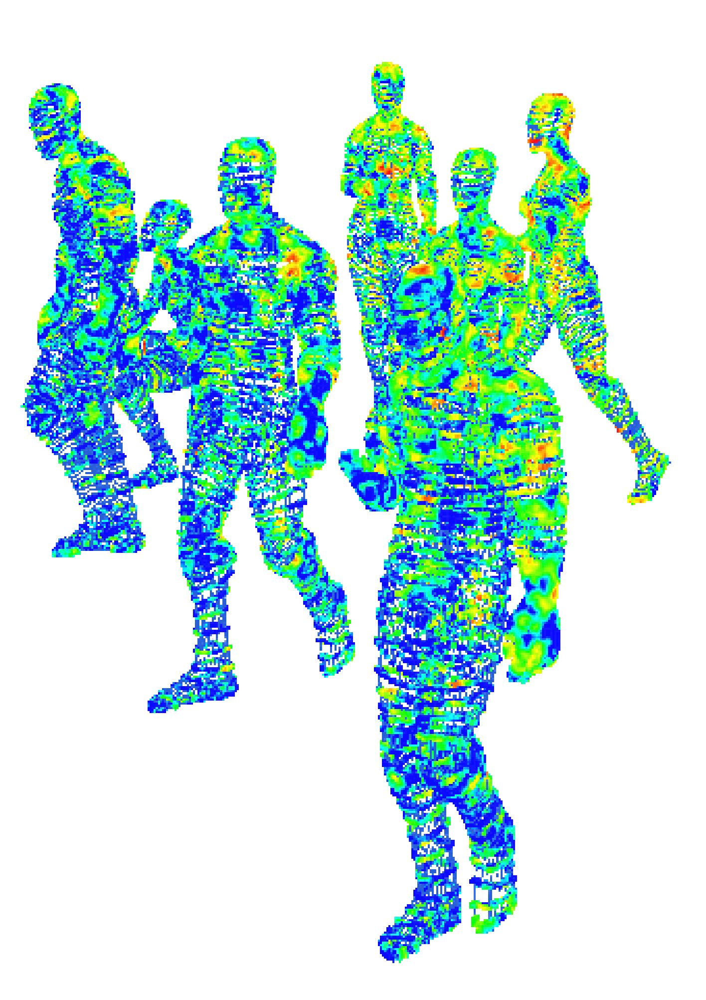
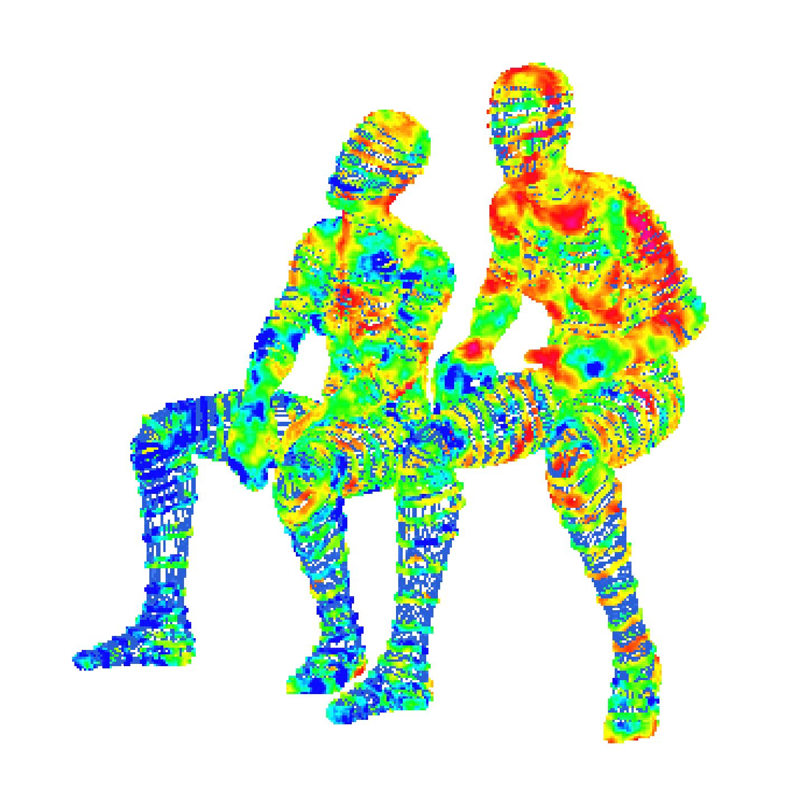
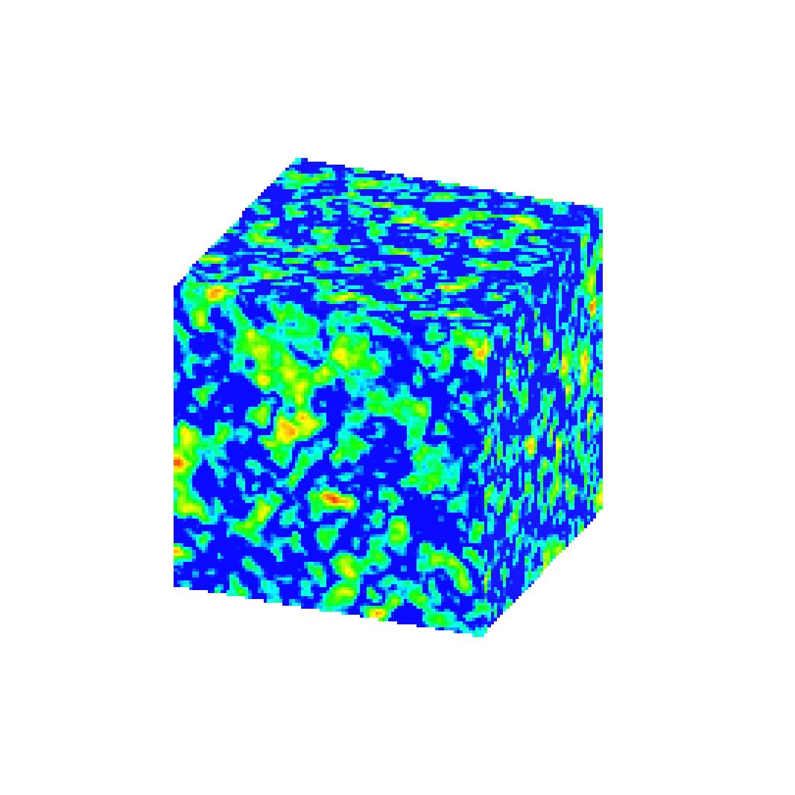

  
Nowear, Théo Hovnanian

  

<h2>NOWEAR</h2> 
 
 

<!-- <footer>– Jesse James Garrett</footer> -->
<!-- 

  -->

<h2>DEEPBLUE</h2> 

  
 
    Il ne fallut pas longtemps avant que les technocrates s’emparent du monde de la mode. Depuis des années, le géant de la tech DeepBlue développait une technologie novatrice, censée révolutionner l’industrie textile. Une tech qui mènerait à la dissolution progressive de la fast-fashion, une solution toute prête à l’absurdité de la production massive de vêtements. Bizarrement, les multinationales de prêt-à-porter n’émettaient que très peu de réserve envers le projet, à l’inverse, elles présentaient un enthousiasme perturbant.
     
Quelques mois avant le lancement de NoWear, les réseaux sociaux commencèrent à être envahis par l’annonce de cette nouvelle tech, avec la promesse d’un futur plus propre, où mode et technologie ne feraient plus qu’un. Cette communication à grande échelle commença progressivement à investir les capitales à travers le monde, à coup d’écrans publicitaires géants loués pour fonctionner jour et nuit. Relayé par les influenceurs, la presse écrite et les journaux télévisés, NoWear s’infiltra partout, des petites communes aux villages isolés, jusqu’à pénétrer l’inconscient collectif. Ce bombardement de messages à tous les niveaux était si bien rodé qu’il n’y avait aucun moyen d’y résister.

   
   
  16/12/32
   
  Cette date était imprimée dans l’esprit de tous. Une conférence relayée en direct de la Silicon Valley allait être diffusée, annonçant le projet dans son ensemble. Je l’attendais avec impatience, à tel point que j’avais prévu de rester éveillé cette nuit-là. Les huit heures de décalage horaire entre la Californie et la France faisaient que la diffusion commençerait à 4h du matin. J’avais cours à huit heures le lendemain mais peu importe, je dormirai quand je serai mort.  
4h37
 
La voix d’Aric Stenmark me réveille de mon pseudo-sommeil. Ouvrant mes paupières difficilement, j’aperçois sa mine faussement accueillante, coachée pour l’occasion. Son visage vient se mêler à la fin de mes rêveries étranges qui le rendent monstrueux. Après un bon quart d’heure de blabla inutile qui me paraît sans fin, le milliardaire se penche vers une petite valise pour en sortir ce qui ressemble à une combinaison néoprène d’un bleu électrique. Il commence à l’enfiler difficilement, entrecoupant le silence de petites plaisanteries préparées à l’avance. La caméra est maintenant dirigée vers l’audience, composée essentiellement de star de la tech et de personnalités politiques au premier rang. Un dégoût s’empare de moi mais je décide de ne pas y prêter attention. Lorsqu’il termine d’enfiler sa combi moulante, il s’agite pour montrer l’aisance de mouvement qu’elle confère.
 
 

  

  <h2>NOWEAR S’INFILTRA PARTOUT</h2> 

  

 
«&#8239;Ce tissu est révolutionnaire, c’est un pur produit de la technologie.&#8239;» L’assemblée applaudit et gueule dans un vacarme exagéré. Il poursuit&#8239;»&#8239;: «&#8239;Ce matériaux n’est comme aucun autre, vous pouvez le porter en hiver comme en été. Mais ce n’est pas tout, la combinaison est composée à 96% de fibres à base d’algue et de cellulose 100% végétale, ce qui en fait un produit respectueux de l’environnement.&#8239;»  Il gesticule mécaniquement pour appuyer son propos. «&#8239;Nous avons breveté le textile en collaboration avec les laboratoires OceanCell, qui travaillent depuis des années sur la confection de matériaux durables.&#8239;» Les applaudissements se font entendre. «&#8239;Ce tissu est aussi une protection vivante.
Il a des vertus antioxydantes, anti-inflammatoires, hypoallergéniques et antibactériennes. Il prévient même les démangeaisons et autres irritations. Vous êtes en train d’assister au futur de la mode.&#8239;» Un silence envahit la salle et je suis pris d’un malaise à travers l’écran. Il est vraiment en train d’essayer de nous vendre des combinaisons moulantes en algue&#8239;? Pourquoi pas, mais je ne vois pas où il veut en venir. Toutes les images que Nowear avait diffusées ces derniers mois montraient bien plus qu’une combinaison, plutôt des pièces hautes coutures et des tenues impossibles.
 
 
 Je sais qu’il y a autre chose, et même si j’ai très envie de dormir, je continue de regarder. «&#8239;Vous êtes déçus&#8239;? Vous vous attendiez à plus&#8239;?...

Vous aviez raison, car vous n’avez encore rien vu.&#8239;» Ma fatigue se transforme en excitation. «&#8239;Vous allez vous voir distribuer à chacun une petite boîte contenant un objet de très haute technologie. C’est une prouesse technique et un avancement technologique majeur.&#8239;» Au premier rang, géants de la tech et politiciens se voient distribuer de petites boîtes noires de la taille d’une clé USB. Les deux écrans géants situés au-dessus de la scène s’allument, le stream se scinde en deux. On y voit un gros plan sur l’objet entre les mains d’Aric. «&#8239;Je vais vous demander de suivre les étapes en même temps que moi. Pour commencer, posez votre index à la surface de l’étui. Il est sécurisé par un 0 contrôle d’accès biométrique et réservé à une utilisation strictement personnelle.&#8239;»
Le petit coffre s’ouvre en un bruit satisfaisant, révélant ce qui semble être deux petits disques de verres légèrement bombés plongés dans un liquide transparent et reflétant une lumière bleue émanant du fond de l’étui. Les chuchotements intrigués de l’audience créent un son étrange, presque hypnotique.
 
  

  

<h2>VOUS N’AVEZ ENCORE RIEN VU</h2> 

  

  «&#8239;Je vous présente les NoWearLenses, les premières lentilles de contact connectées.&#8239;» Un brouhaha disproportionné jaillit alors du public. Par-dessus l’agitation générale, Aric ajoute «&#8239;pour ceux qui ont l’habitude d’en porter, vous pouvez les poser sur vos yeux dès maintenant. Pour les autres, des techniciens vont venir vers vous.&#8239;» Un gros plan sur l’oeil du technocrate la montre écartant largement ses paupières, révélant la surface de son globe oculaire. Pendant quelques secondes, j’ai l’impression de voir l’intérieur du technocrate, cette courte absence de paupière le rend dénué d’émotions, jusqu’à ce qu’il pose enfin la lentille sur son oeil.
   
 
  Mon regard est attiré par le chat, les centaines, les milliers de commentaires qui défilent à la minute sur le panneau à droite du stream. Pendant qu’Aric pose sa deuxième lentille, j’écris «&#8239;clockwork orange vibes&#8239;», mon message se fond instantanément dans le flux constant de caractères pour se perdre à tout jamais dans un océan d’émottes et de spams en tous genres. Déçu, je repose mon regard sur le stream. «&#8239;Maintenant que vous portez vos NoWearLenses, je vais vous demander de refermer l’étui et tapoter trois fois sa surface avec votre index.&#8239;» Il s’exécute, et dans l’instant se matérialise sur le corps du technocrate une tenue tout droit sortie d’un défilé Banagacci. Taillé à la perfection, le tissu épouse son corps parfaitement, glissant en drapés très réalistes.
  Les acclamations du public se font plus fortes encore que les dernières, et le chat n’est plus qu’une bouillit de caractères se mouvant à une vitesse phénoménale.
   Ça y est, j’ai compris, ces lentilles marquent le début de l’entrée de notre monde dans une réalité augmentée. Je ne sais pas qu’en penser. Pour le moment, je suis fasciné.
    
 
Les lumières s’éteignent, l’euphorie générale redescent peu à peu, mais on sent qu’elle peut repartir de plus belle. Ca ne rate pas, les lumières se rallument, Aric a disparu mais une douzaine de mannequins sortent de chaque côté de la scène, portant des tenues numériques aux propriétés physiques impossibles. Imittant des matières organiques, fongiques, sporadiques, gonflantes, vibrantes, brillantes et luminescentes, au spectre de couleur très large, le tout accompagné de hard-techno entrainante. Les possibilités sont infinies, les limites textiles n’existent plus, il me faut les NoWearLenses.
    

 

 

  
  

  <h2>UN DIGIFIT PIRATÉ</h2> 

  
 - Tu penses que c’est un vrai digifit Cavaroeur&#8239;?  
- Bah écoute ça a l’air, elle porte une combi   DeepBlue donc ça m’étonnerait pas, c’est assez risqué de porter du cracké sur les combis corpos.  
- Pffff, qui a les moyens pour ça... Et puis elle y risquerait quoi&#8239;?  
- Elle pourrait être bannie biométriquement de DeepBlue.  
- Ah ouais chaud...  
- Et puis ça se reconnaît assez facilement un digifit piraté, surtout pour des collections ultras limitées comme celle-là. Ça m’étonnerait même pas que la sienne soit unique, suffit de vérifier le token associé, attends.  
D’un mouvement impatient, Adika sort de sa poche son Thinglass, scannant discrètement la tenue de la jeune femme avant qu’elle ne disparaisse à l’angle de la rue.  
- Tu vois, c’est une vraie, jt’avais dit&#8239;!  
- Mouais, en tout cas, je trouve ça absurde de payer si cher pour un token alors que tu peux l’avoir gratuitement, c’est complètement con.  
- Ces gens-là jouent leur réput en portant de la contrefaçon, ils ne peuvent pas se le permettre. Comme toi tu peux pas te permettre d’acheter du matos Deep Blue. 
- Jt’emmerde, je veux pas porter de DeepBlue, c’est une conviction.  
- Tu m’emmerdes mais en attendant tu portes des digifits que personne peut voir.  
- Tu vois bien ce que je porte là non&#8239;? Alors arrête un peu, suffit d’installer un plugin c’est pas bien méchant.  
- T’inquiète Raidd, j’te taquine, je sais que t’es dans le vrai, jpense que je vais bientôt vendre mon matos pour me mettre au libre.  
- Ca fait des semaines que du me dis ça, j’y crois plus vraiment.  
- ... En même temps j’ai toutes mes tenues chez DeepBlue, et le portage est impossible vers OpenWear.
  

  

 <h2>POUR CHANGER...</h2> 
  
  

- Alors le plus tôt sera le mieux&#8239;! Et puis j’ai plein d’adresses pour retrouver les mêmes tenues gratuitement.
 
- Ouais t’as peut-être raison...
 
- Mais J’AI raison&#8239;! Mon matos me traque pas, mes données sont safe, je suis invisible aux yeux de la tech, je peux charger n’importe quelle tenue et je n’ai pas vendu un rein pour mes lenses. Bon d’accord, les interfaces sont moins léchées que celles de NoWear mais franchement le principe est le même. Et puis ce n’est pas comme s’il existait que Deep Blue, trouve les lentilles WearSoft beaucoup mieux optimisées, même si j’utilise pas l’OS original.
 
- Attend, ça veut dire que je peux installer OpenWear sur mes lentilles&#8239;?
 
- Bah ouais complètement, jte conseille vivement de le faire, et puis si tu veux faire une transition douce tu peux l’installer en dual-boot.
 
- T’es trop smart, moi j’ai la flemme de faire tout ça.
 
- T’inquiète Adika jt’aiderais, je vais pas laisser ma pote continuer à porter cette immonde combi bleue&#8239;!
Elle pouffe de rire.
 
- Rhooo t’es pas cool, tout le monde en porte.
 
- Ca veut pas dire que tu dois le faire aussi, on se croirait à un séminaire de plongée. 
- Bon j’en ai assez de parler de tech, vient on bouge, je commence à avoir faim.
 
Il faisait beau, un peu trop pour un début de printemps. Adika et Raid sillonnaient les rues pleines du monde à la recherche d’un casse-dalle digne de ce nom, quoi de mieux qu’une grecque bien chargé à 16h30&#8239;? À ce moment précis, rien. C’était un samedi normal, les deux potes avaient l’habitude de passer leur week-end ensemble. Le samedi elles se racontaient leurs semaines de taff, mangeaient ensemble, et passaient la nuit en soirée techno clandestine. Le dimanche, elles se réveillaient généralement vers 14h, fumaient jointes sur le joint et chargeaient des plugins psychés sur leurs lenses, le rêve.
 
- Meuf, tu m’as pas raconté ta soirée avec le mec d’hier soir&#8239;?
 
- Ouais en même temps chelou le type.
 
- Pour changer...
 
- Au début il avait l’air sympa ça matchait bien et tout. Jusqu’à ce que je le ramène chez moi.
 
- Comment ça&#8239;? Il a fait quoi ce fou&#8239;?

  

  
  

  <h2>ERRANTS DE LA MANIÈRE DE PNJ</h2> 
  

  - Il s’est rien passé de ouf mais au moment où on entrait dans le vif du sujet il s’est arrêté et il m’a demandé si je pouvais charger un skin d’une soi-disant actrice, que c’était son phantasme blablabla.
   
- Ah ouais le détraqué, et t’as dit quoi&#8239;?
 
- Bah je l’ai envoyé se faire foutre&#8239;!
Adika meurt de rire.
 
- T’es vraiment la meilleure, en ce moment j’ai tellement envie de ken que j’aurais accepté.
 
- Nan Jte jure meuf t’aurait vu sa gueule on aurait dit qu’il s’était fait tamponner par un bus.
Les deux partent en fou rire, Raid sèche ses larmes pour scander un «&#8239;TE sont vraiment connes.&#8239;» plutôt amical.
Avachies sur la petite terrasse du meilleur grec du coin, Adika et Raid s’amusaient à regarder les passants tout en dévorant leurs délicieux sandwichs.
 
 
Cette petite place du centre-ville était plutôt isolée, mais on y trouvait quand même des livingads, de véritables publicités ambulantes, des humains sous-payés à sillonner l’espace publique, chargés d’un digifit typographique aux divers textes défilants et clignotants, utilisant le moindre espace disponible pour faire passer des messages et faire la communication de marques et d’entreprises en tous genres. 
    L’espace public était envahi de ces travailleurs d’un nouveau genre, payés au temps de regard et au taux de conversion. Raidd avait installé une extension pour que leurs digifits ne s’affichent pas, plutôt pratique. À travers ses lenses, les livingads apparaissaient comme de simples passants, à la différence qu’ils répétaient sans cesse le même parcours, errants à la manière de PNJ tout droit sortis d’un jeu vidéo des années 2000. Ce phénomène ne choquait plus personne, cela faisait partie du décors.
     
01/05/2043
 
K ne portait que de l’opensource. Il était posté sur le toit d’un immeuble qui donnait sur une grande place, d’ici, il avait vue sur le coeur de la manifestation.

  

  

  <h2>UNE BOUILLIE DE PIXEL DIFFUSE</h2> 

  

  

  K était un invisible, ses données n’appartenaient qu’à lui, personne ne le traquait, en revanche, lui pouvait traquer n’importe qui. Du haut des 28 mètres qui le séparaient du sol, il voyait le cortège de tête avancer face à un dispositif policier menaçant. Les manifestants scandaient des hymnes fédérateurs, leurs digifits affichaient des slogans qui défilaient le long de leur corps. La colère et l’indignation s’exprimaient en épousant leur morphologie, l’action politique devenait une seconde peau. Au-devant du cortège qui s’avançait, environ 20 personnes avaient synchronisé leurs digifits pour afficher leurs revendications à la manière d’une banderole, comme on pouvait en voir quelques décennies auparavant, à la différence que celle-ci était animée et pouvait diffuser n’importe quel média visuel en temps réel. Sur le toit, K ne voyait qu’une bouillie de pixel diffuse.
  
  Il venait de récupérer les données de chaque flic présent sur la place, tout ça grace à leurs digifits. Eux aussi s’en servaient comme supports de messages, ou plutôt comme support de sommation et de contrôle. Mais si K pouvait le faire, les flics aussi, chaque manifestant voyait leurs infos chargées sur une base de données dès lors qu’ils entraient dans le périmètre de la manifestation, c’est d’ailleurs pour ça que la plupart d’entre eux y participaient en portant des digifits jailbreakés, chargeant de fausses identités qui changeaient à intervalles réguliers.

K tapait des lignes de code sur le clavier de son thinglass, il vérifiait une dernière fois ce qu’il avait écrit avant de lancer son programme. La confrontation était proche, la police bloquait la suite du parcours, la tension commençait à se faire sentir. Des premières grenades lacrymogènes furent lancées dans la foule. C’est là où K décida de démarrer l’opération.
 
Soudain, les digifits des flics se brouillèrent pendant quelques millisecondes pour laisser apparaitre des slogans contestataires, des «&#8239;ACAB&#8239;» et autres «&#8239;1312&#8239;» se baladant sur leurs bras et leurs jambes. Ils commencèrent à reculer franchement, comme aveuglés, certains commençaient même à enlever leurs lenses, s’exposants à leurs propres lacrymogènes.
 
L’attaque de K dura quelques bonnes minutes, ce qui laissa l’occasion à la foule de poursuivre son parcours.La police détecta l’origine du hack assez vite, mais lorsqu’ils arrivèrent sur le toit, K avait disparu.
  

    

  

