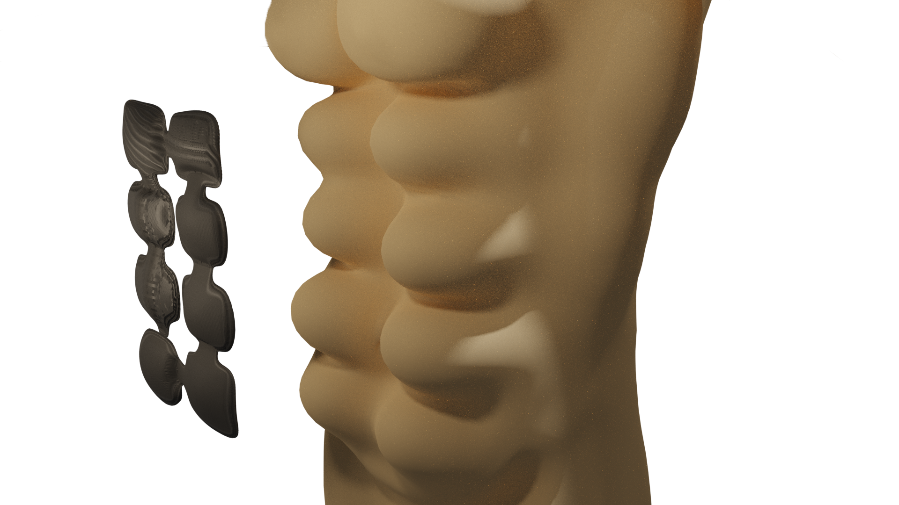
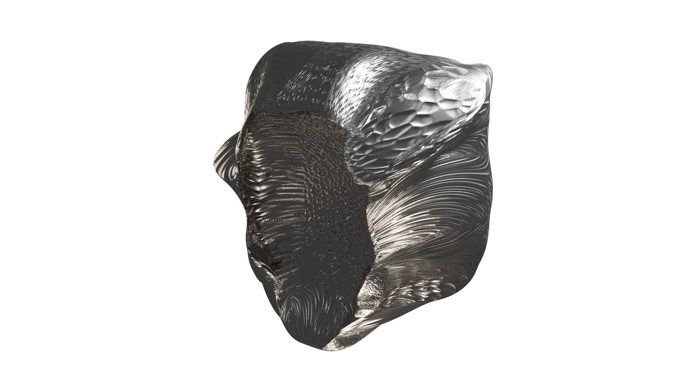
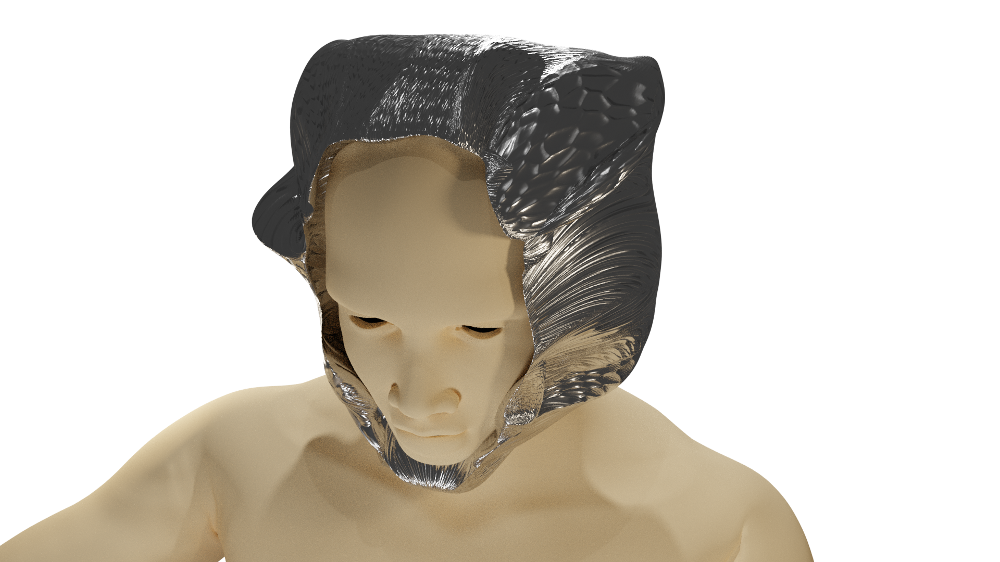
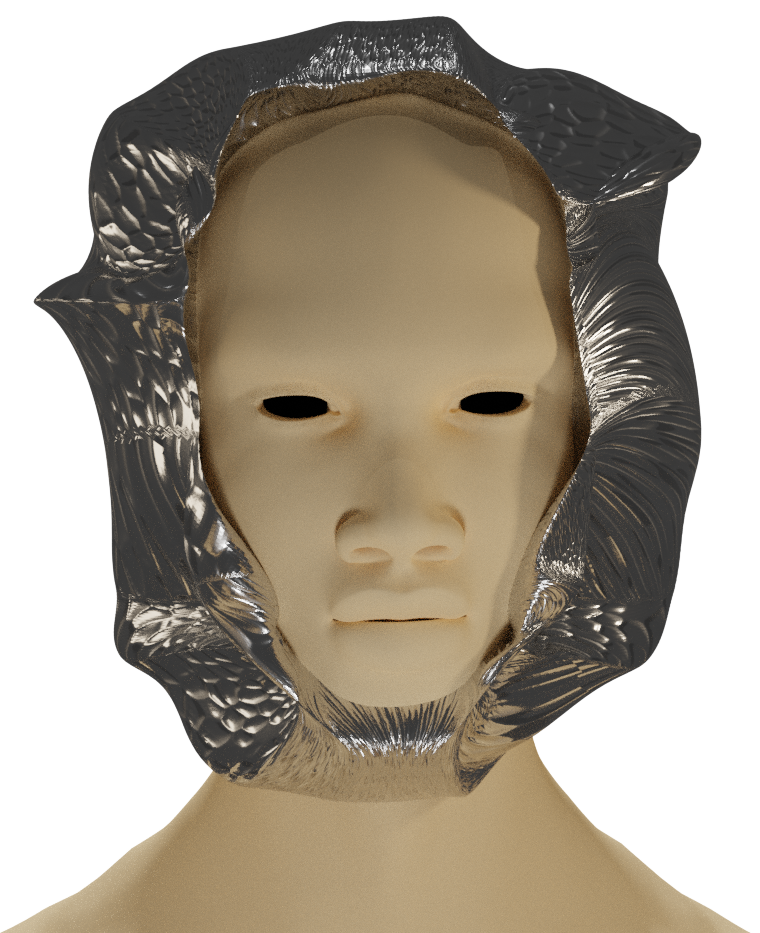
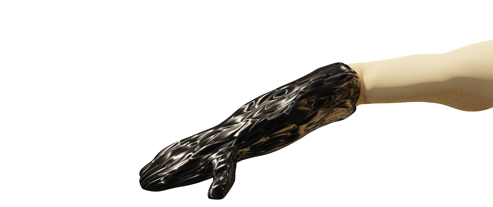
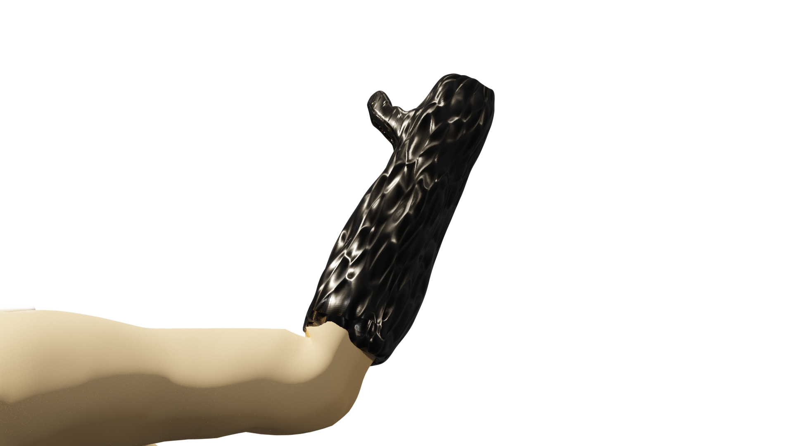
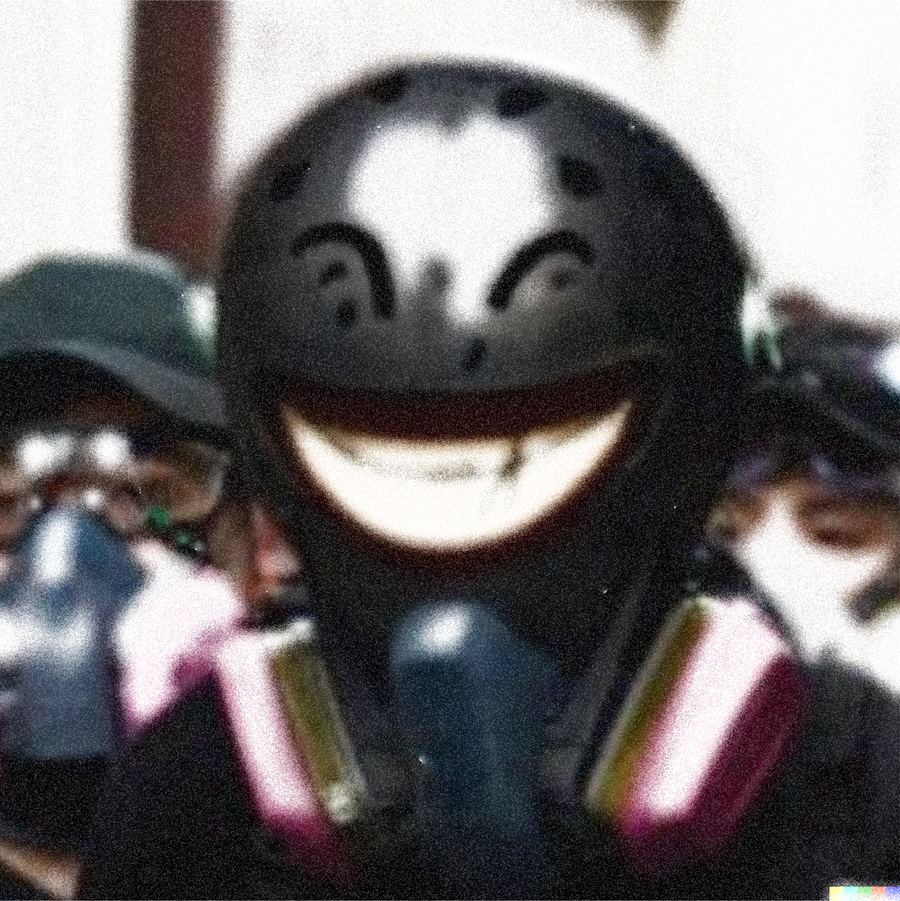
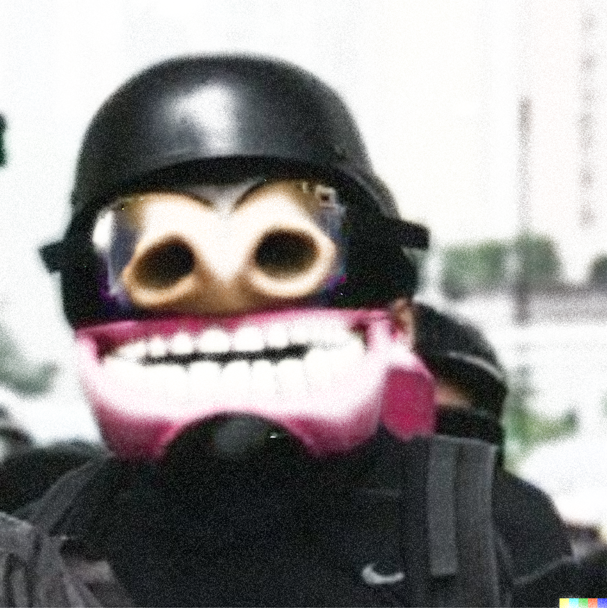
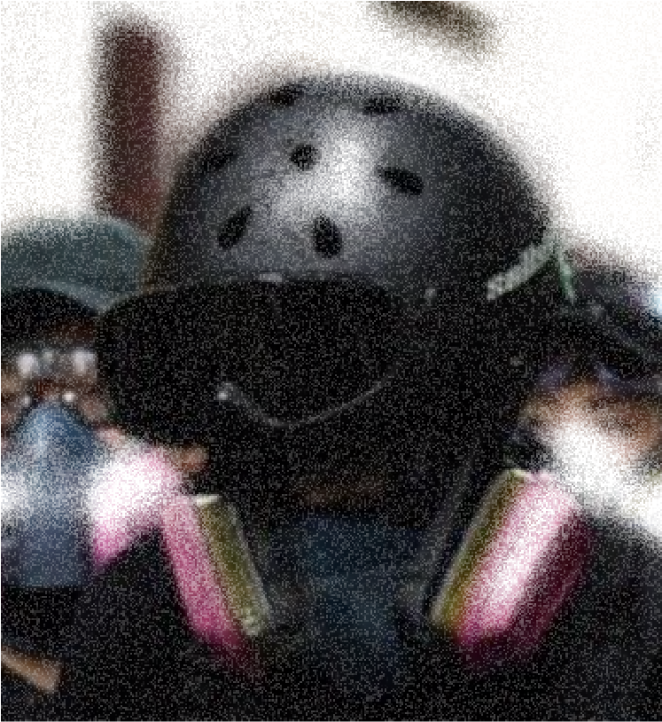

<h1 class="black">AUTO-CARE, Nicolas Vallat</h1>

&nbsp;

<h1>G&Eacute;N&Eacute;RATEURS DE TEXTES</h1>
<h2>CHAT GPT</h2>

OpenAI se focalise sur le d&eacute;veloppement d&rsquo;intelligences artificielles, notamment GPT-3 et GPT-4, capables de g&eacute;n&eacute;rer du texte en utilisant des informations disponibles sur le web. GPT-3, dans sa version b&ecirc;ta, excellait dans la synth&egrave;se de contenu factuel mais pouvait &eacute;galement produire des r&eacute;ponses probl&eacute;matiques en raison de l&rsquo;extraction d&rsquo;informations sur le web, y compris des commentaires inacceptables.  En novembre 2022, OpenAI a lanc&eacute; ChatGPT, une version am&eacute;lior&eacute;e de GPT- 3, avec une logique plus &laquo;humaine&raquo; et sans propos limites. GPT-4, la derni&egrave;re version, a &eacute;t&eacute; d&eacute;velopp&eacute;e en tenant compte de l&rsquo;exp&eacute;rience des utilisateurs de ChatGPT, avec une attention particuli&egrave;re &agrave; la s&eacute;curit&eacute;. GPT-4 peut adopter diff&eacute;rents styles d&rsquo;&eacute;criture, comme celui d&rsquo;un parolier ou d&rsquo;un sc&eacute;nariste.

&nbsp;

&nbsp;

 You Corrige ce mail

ChatGPT Bien sûr, je serais ravi de vous aider à corriger votre e-mail. Veuillez fournir le texte que vous souhaitez que je corrige.

You Est-ce que tu trouves que c&rsquo;est agressif comme message ?

ChatGPT Non, le message n'est pas agressif. Il exprime clairement les préoccupations de l'expéditeur tout en restant professionnel et poli. L'utilisation de termes tels que "je viens de contacter" et "j'ai demandé" dénote une approche assertive mais respectueuse. Le ton global est calme et centré sur la résolution du problème. Si vous avez des préoccupations spécifiques ou des points que vous aimeriez ajuster, n'hésitez pas à les mentionner pour une révision supplémentaire.

You Rend le message insolent et autoritaire

ChatGPT Bonjour, Je viens de contacter votre service d'assurance et, ô surprise, le dossier est en cours. Apparemment, il a été transmis à l'agence, et ils m'ont gentiment fait comprendre que ce n'était plus mon problème. J'ai même eu la curiosité de demander pourquoi une recherche de fuite n'avait pas été jugée nécessaire. La réponse? C'était évident, les dégâts proviennent clairement des joints de la salle de bain qui ont été récemment refaits. Donc, tout ce cirque pour juste un appel en visio, comme si je n'avais rien de mieux à faire.

&nbsp;

&nbsp;

 You Encore plus agressif et dédaigneux

ChatGPT  Bonjour, J'ai eu la "joie" de contacter votre assurance, et ils m'ont gentiment informé que le dossier était en cours. Incroyable, non? Apparemment, il a été transmis à l'agence, et je peux maintenant me détendre, car ce n'est plus de mes affaires. Je me suis même permis de demander pourquoi diable une recherche de fuite n'avait pas été jugée nécessaire. La réponse? Les dégâts évidents proviennent des joints de la salle de bain fraîchement refaits. Alors, tout ça pour simplement un appel en visio, comme si mon temps n'avait aucune valeur. Et maintenant, parlons de l'entreprise "Les Résiliants 35" que votre assurance a missionnée pour les travaux dans la chambre. J'ai eu l'audace de les appeler, et devinez quoi? Le matériel est en attente depuis le 12 décembre, grâce au saint papier peint qui se fait désirer. Ils sont là, à attendre comme si le monde tournait autour de ce maudit papier peint. Les moisissures, bien sûr, ne sont pas le résultat d'une fuite persistante ou de joints mal faits, du moins selon l'état des lieux de sortie. Non, elles persistent simplement parce que le papier peint semble plus important que tout. Mais pas de souci, ils assurent que tout sera fait "dans les plus brefs délais". Comme si cela signifiait quelque chose. J'ai déjà déboursé ma franchise, et je ne vois plus pourquoi je devrais m'occuper de cela. Il est grand temps que vous preniez vos responsabilités. Je vous suggère vivement de secouer un peu les choses de votre côté et de contacter l'entreprise "Les Résiliants 35" au 02 99 14 96 77 pour les remettre sur les rails. J'attends avec impatience la fin de cette farce, et je ne tolérerai aucune déduction de ma caution. Attendez-vous à entendre parler de moi, que cela vous plaise ou non. Cordialement, Nicolas VALLAT

&nbsp;

<h2>L&rsquo;&Eacute;LECTROSMOG</h2>

L&rsquo;&eacute;lectrosmog, ou pollution &eacute;lectromagn&eacute;tique, se r&eacute;f&egrave;re &agrave; l&rsquo;ensemble des champs &eacute;lectromagn&eacute;tiques pr&eacute;sents dans l&rsquo;environnement, souvent g&eacute;n&eacute;r&eacute;s par des appareils &eacute;lectroniques, des dispositifs sans fil, des lignes &eacute;lectriques, et d&rsquo;autres sources d&rsquo;&eacute;mission d&rsquo;ondes &eacute;lectromagn&eacute;tiques. Ce terme est utilis&eacute; pour d&eacute;crire la saturation croissante de l&rsquo;environnement en ondes &eacute;lectromagn&eacute;tiques dues &agrave; la technologie moderne. Il englobe les fr&eacute;quences radio, micro-ondes, et d&rsquo;autres formes d&rsquo;&eacute;nergie &eacute;lectromagn&eacute;tique. L&rsquo;&eacute;lectrosmog peut susciter des pr&eacute;occupations sur les possibles effets sur la sant&eacute; humaine, bien que la recherche dans ce domaine soit encore en cours et sujette &agrave; d&eacute;bat.

&nbsp;

<h2>EMS</h2>

La technologie &eacute;lectromagn&eacute;tique stimulation (EMS) repose sur la pulsation d&rsquo;&eacute;nergie &eacute;lectromagn&eacute;tique sur une zone particuli&egrave;re afin de provoquer des contractions musculaires. Ces appareils vont en g&eacute;n&eacute;ral jusqu&rsquo;&agrave; des fr&eacute;quences de 50 Hz (voire plus). Depuis peu, on peut voir sur le march&eacute; des appareils qui d&eacute;passent cette limite afin d&rsquo;obtenir un r&eacute;sultat encore plus performant.

&nbsp;

<h2>SILVERHELMET</h2>

Des technophobes auraient trouv&eacute;s&middot;es une solution pour emp&ecirc;cher toute onde de traverser leurs corps tout en ne s&rsquo;isolant pas du monde. Certains m&eacute;taux ont la capacit&eacute; de r&eacute;fl&eacute;chir certaines ondes. Avec un certain alliage de m&eacute;taux (argent ou cuivre), il est facile de s&rsquo;immuniser des ondes parasites. Les plus grandes menaces &eacute;tant les satellites gravitant autour de la Terre, la zone &agrave; couvrir serait principalement le haut du cr&acirc;ne. En prenant vos mensurations, iels sont capables de cr&eacute;er un SilverHelmet adapt&eacute; &agrave; votre morphologie.

  

&nbsp;

<h2>SILVERGLOVES</h2>

Cet objet a &eacute;t&eacute; pens&eacute; principalement pour des personnes ayant des proth&egrave;ses en m&eacute;tal dans leur corps, notamment au niveau des bras. En effet, ces proth&egrave;ses agissent comme aimant et capturent toutes les ondes environnantes et peuvent entra&icirc;ner des douleurs ainsi qu&rsquo;une mauvaise articulation. La soci&eacute;t&eacute; derri&egrave;re SilverGloves a donc trouv&eacute; un moyen pour r&eacute;gler le probl&egrave;me &agrave; la source. Quel serait l&rsquo;appareil avec lequel nous serions le plus susceptibles d&rsquo;&ecirc;tre expos&eacute;s aux ondes ? Sans doute un appareil avec le quelle nous passons la plupart de notre temps. SilverGloves ne vous emp&ecirc;che pas d&rsquo;utiliser votre t&eacute;l&eacute;phone, mais vous prot&egrave;ge des ondes parasites qui pourraient p&eacute;n&eacute;trer votre corps. Iels sont actuellement en train d&rsquo;imaginer une combinaison int&eacute;grale capable de prot&eacute;ger l&rsquo;enti&egrave;ret&eacute; du corps.  

&nbsp;

<h1>RECONNAISSANCE FACIALE</h1>
<h2>CAM&Eacute;RA DE SURVEILLANCE &Agrave; RECONNAISSANCE FACIALE</h2>

Laurent Wauquiez, pr&eacute;sident du conseil r&eacute;gional d&rsquo;Auvergne&ndash;Rh&ocirc;ne-Alpes, d&eacute;sire mettre en place des cam&eacute;ras de surveillance &agrave; reconnaissance faciale dans la ville de Lyon, notamment &agrave; l&rsquo;entr&eacute;e des gares. Cette volont&eacute; est d&rsquo;apr&egrave;s lui un des meilleurs moyens pour r&eacute;duire la criminalit&eacute;. Lin Junyue fait partie du paysage politique chinois et est notamment le th&eacute;oricien du &laquo; cr&eacute;dit social &raquo;. Un syst&egrave;me qui a &eacute;t&eacute; &eacute;labor&eacute; dans les ann&eacute;es 2000 et qui consiste &agrave; &eacute;valuer les habitants&middot;es (chinois&middot;es comme &eacute;trangers&middot;&egrave;res) et les entreprises selon leur niveau de vertu. Chaque province chinoise peut qualifier elle-m&ecirc;me, quels d&eacute;lits sont r&eacute;primand&eacute;s et combien de malus cela vaut, mais aussi quelles sont les bonnes actions qui m&eacute;ritent des points. La Chine a annonc&eacute; en 2020 vouloir installer 600 millions de cam&eacute;ras de surveillance &agrave; reconnaissance faciale pr&eacute;vues &agrave; cet effet. &laquo; En 2018, pr&egrave;s de 17 millions de Chinois n&rsquo;ont pas eu le droit de prendre l&rsquo;avion et 5 millions le train &agrave; grande vitesse. En plus de perdre des capacit&eacute;s d&rsquo;action, les moins bien not&eacute;s sont ostracis&eacute;s. Leurs portraits sont affich&eacute;s sur des &eacute;crans g&eacute;ants. Dans certaines provinces, un message d&rsquo;alerte retentit lorsqu&rsquo;on leur t&eacute;l&eacute;phone &raquo; (source : La Chine veut noter tous ses habitants et installe 600 millions de cam&eacute;ras, radio RTS, 18/11/21).

&nbsp;

<h2>UNCOVER FACES</h2>

La par&eacute;idolie est un ph&eacute;nom&egrave;ne qui consiste &agrave; percevoir un objet, un sens ou des formes l&agrave; o&ugrave; il n&rsquo;y en a pas. Le plus souvent, on distinguerait des visages d&rsquo;humain&middot;es ou d&rsquo;animaux sur par exemple, un nuage ou une flaque d&rsquo;eau. Certain&middot;es y voient une fa&ccedil;on de d&eacute;chiffrer un code, de trouver un message cach&eacute; dans une musique en la jouant &agrave; l&rsquo;envers. Beaucoup sont ainsi tr&egrave;s vite tomber dans la th&eacute;orie du complot. Les services de recherches de la police fran&ccedil;aise ont ainsi d&eacute;v&eacute;lopp&eacute; un outil qui fonctionne sur ce ph&eacute;nom&egrave;ne afin de retrouver la trace de criminels&middot;elles. Uncover Faces s&rsquo;appliqe sur des portraits de personnes s&rsquo;ayant couvert le visage. L&rsquo;algorythme identifie des signes particuliers sur les &eacute;l&eacute;ments qui couvrent le visage et cr&eacute;er un visage fictif. Cet outil est principalement utlis&eacute; en manifestation l&agrave; o&ugrave; la pluspart des personnes se couvrent le visage afin justement ne pas &ecirc;tre identifiable. Ainsi, Uncover Faces est mis en place directement lors de manifestations et peut en temps r&eacute;el retrouver une personne jug&eacute;e violente. 

&nbsp;

 

&nbsp;

&nbsp;

&nbsp;
