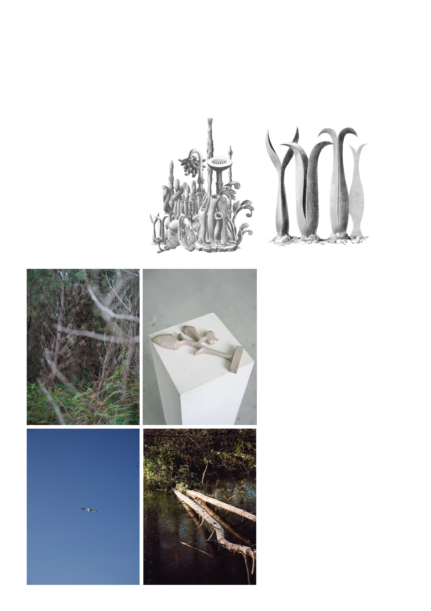
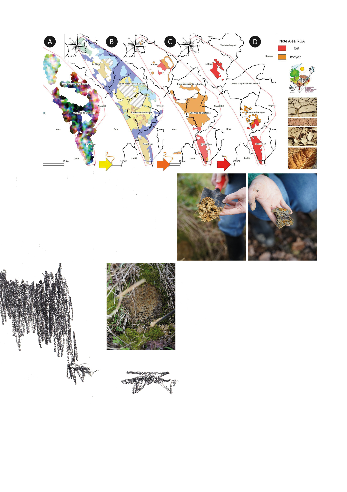

<!-- Contenu -->
<h6 class="titre">&nbsp;</h6>

<h3 style="text-align: right;">T&ecirc;te contre t&ecirc;te avec le tournesol&nbsp;</h3>
<h3 style="text-align: right;">Joue contre joue avec la rose&nbsp;</h3>
<h3 style="text-align: right;">Nous suivons une route secr&egrave;te&nbsp;</h3>
<h3 style="text-align: right;">M&eacute;connue des voyageurs</h3>
<h3 style="text-align: right;">&nbsp;</h3>
<h3 style="text-align: right;">L&rsquo;or qui g&icirc;t au fond de la fleur repli&eacute;e&nbsp;</h3>
<h3 style="text-align: right;">Est toute notre richesse&nbsp;</h3>
<h3 style="text-align: right;">Nous mangeons le coeur de la for&ecirc;t&nbsp;</h3>
<h3 style="text-align: right;">Avec une furtivit&eacute; innocente</h3>
<h3 style="text-align: right;">Nous connaissons les chemins anciens</h3>
<h3 style="text-align: right;">Sur la feuille de l&rsquo;ortie</h3>
<h3 style="text-align: right;">Et nous baignons dans le bleu profond</h3>
<h3 style="text-align: right;">Du p&eacute;tale de la v&eacute;ronique&nbsp;</h3>

<h3 style="text-align: right;"><strong>Mary Webb</strong></h3>

&nbsp;

<h1 class="white-color mb-10" style="text-align: right;">CARTAGILE</h1>