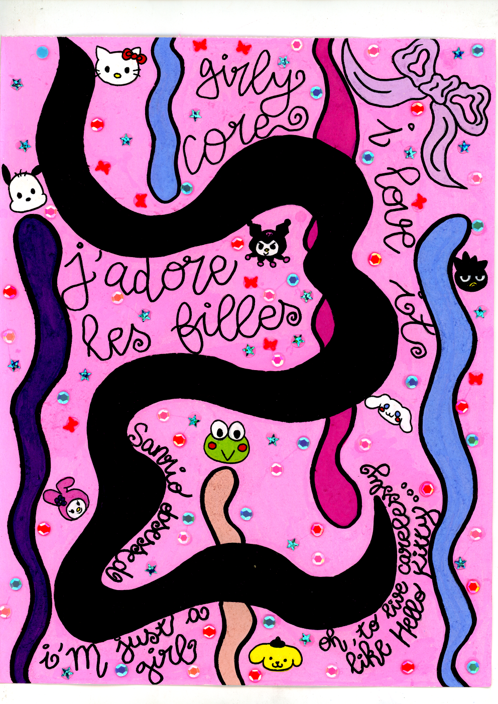

<strong>j'imagine parfois - souvent - dans mes r&ecirc;ves que la maladie m'a</strong> <strong>quitt&eacute;, qu'elle a d&eacute;cid&eacute; de me laisser tranquille, que j'ai assez souffert,</strong> <strong>et que maintenant j'ai le droit de vivre comme tous autres, ceux</strong> <strong>qui n'ont pas &agrave; s'en soucier.</strong>

<h4><strong>j'ai beau faire confiance &agrave; la m&eacute;decine, je sais aussi que</strong> <strong>je ne connaitrais pas le progr&egrave;s (si fulgurant que &ccedil;a puisse</strong> <strong>gu&eacute;rir et soigner des maladies rares et des troubles neurolo-</strong> <strong>giques) de mon vivant.</strong></h4>

<strong>un jour, peut-&ecirc;tre, dans un futur plus ou moins proche, j'arr&ecirc;terais</strong> <strong>de prendre un traitement quotidien,</strong>

<h4><strong>j'arr&ecirc;terais de pr&ecirc;ter attention &agrave; des choses</strong> <strong>futiles, inutiles, idiotes, comme</strong></h4>

<strong>"qu'est-ce que les autres vont penser de moi si j'enl&egrave;ve le</strong> <strong>masque ?"</strong>

<h4><strong>"et si plus personne ne voulait rester &agrave; mes </strong> <strong>c&ocirc;t&eacute;s si je reste malade toute ma vie ?"</strong></h4>

<strong>"est-ce que je vais vivre longtemps ou bien je vais</strong> <strong>mourir jeune &agrave; cause de tout &ccedil;a ?"</strong>

<strong>"et si je ne prenais pas assez le temps</strong> <strong>de profiter maintenant et que je </strong> <strong>regrettais plus tard ?"</strong>

<h4><strong>"et si j'avais &eacute;t&eacute; 'normale', est-ce que</strong> <strong>j'aurais pr&eacute;f&eacute;r&eacute; vivre ?"</strong></h4>

<strong>je vais rebrancher mon cerveau et le forcer &agrave; vivre</strong> <strong>&agrave; plein temps dans le monde merveilleux</strong> <strong>des dessins anim&eacute;s, o&ugrave; tout le monde il est beau</strong> <strong>et tout le monde il est gentil, tout le temps,</strong> <strong>partout.</strong>

<h4><strong>Inspirons-nous de Hello Kitty. Svp.</strong></h4>

