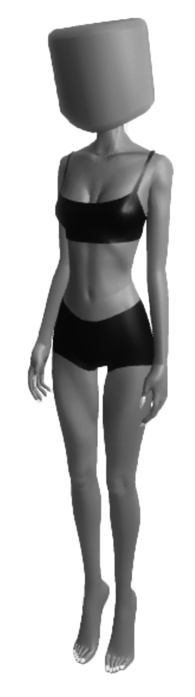

<h6>jeu2filles</h6>

&nbsp;

&nbsp;

<blockquote>

<strong>Bertrand Legrand</strong>: Bonjour et merci d&rsquo;&ecirc;tre avec nous aujourd&rsquo;hui. On parle souvent de misogynie, mais vous &ecirc;tes l&agrave; pour aborder le th&egrave;me de la... misandrie, c&rsquo;est bien &ccedil;a <strong>?</strong>

&nbsp;

<strong>La femme</strong> : Oui, tout &agrave; fait. La misandrie, c&rsquo;est un terme utilis&eacute; pour d&eacute;crire et se r&eacute;-approprier&mdash;

&nbsp;

<strong>B.L</strong> : Alors attendez, juste pour clarifier, la misandrie, c&rsquo;est... c&rsquo;est litt&eacute;ralement la haine des hommes, n&rsquo;est-ce pas ? Je veux dire, je trouve &ccedil;a fascinant, parce que dans notre soci&eacute;t&eacute; actuelle, on parle beaucoup de l&rsquo;oppression des femmes, mais on oublie parfois que les hommes, nous aussi, on subit des... disons, des critiques injustes.

&nbsp;

<strong>La femme</strong> : C&rsquo;est vrai qu&rsquo;il peut y avoir des critiques, mais en fait la misandrie ne se traduit pas n&eacute;cessairement par&mdash;

&nbsp;

<strong>Bertrand</strong> : Absolument ! Mais ce que je veux dire, c&rsquo;est que dans le contexte moderne, on voit &eacute;norm&eacute;ment de stigmatisation contre les hommes. Par exemple, avec des expressions comme &laquo; mansplaining &raquo;... Vous savez, ce mot qui suppose qu&rsquo;un homme ne peut pas juste expliquer quelque chose sans &ecirc;tre accus&eacute; de condescendance. Franchement, c&rsquo;est un vrai probl&egrave;me pour beaucoup d&rsquo;entre nous.

&nbsp;

<strong>La femme</strong> : Oui, alors &laquo; mansplaining &raquo; est un terme qui est n&eacute; pour exprimer le d&eacute;s&eacute;quilibre lorsqu&rsquo;un homme&mdash;

&nbsp;

<strong>B&eacute;bert</strong> : Oui, exactement, et c&rsquo;est l&agrave; que je trouve que les hommes sont particuli&egrave;rement incompris. Vous savez, c&rsquo;est un peu comme... Comment dire ? On peut dire quelque chose sans avoir de mauvaises intentions et, tout de suite, on est qualifi&eacute;s de paternalistes. &Ccedil;a montre bien cette forme de misandrie sous-jacente dans la soci&eacute;t&eacute;, vous voyez ce que je veux dire ?

&nbsp;

<strong>La femme</strong> : Euh, oui, je comprends, mais le terme de misandrie est en r&eacute;alit&eacute; utilis&eacute; pour d&eacute;crire des sentiments qui peuvent aller au-del&agrave; des petites incompr&eacute;hensions&mdash;

&nbsp;

<strong>Le g&eacute;ant B</strong> : Bien s&ucirc;r, oui, mais, enfin, si on y pense, l&rsquo;oppression que les hommes ressentent, elle n&rsquo;est pas si diff&eacute;rente de celle que les femmes disent ressentir. Je dirais m&ecirc;me qu&rsquo;on ne parle pas assez des pressions &eacute;normes qui p&egrave;sent sur nous, les hommes. En tant qu&rsquo;homme, c&rsquo;est presque comme si nous &eacute;tions oblig&eacute;s de nous excuser d&rsquo;exister dans certains espaces.

&nbsp;

<strong>La femme</strong> : Ce que vous dites est int&eacute;ressant, mais quand on parle de misandrie, ce n&rsquo;est pas pour minimiser&mdash;

&nbsp;

<strong>Big Bert</strong> : Ah, mais justement, c&rsquo;est l&agrave; o&ugrave; je voulais en venir ! Vous voyez, ce que beaucoup de gens, hommes ou femmes d'ailleurs, n&rsquo;arrivent pas &agrave; saisir, c&rsquo;est que la misandrie est tr&egrave;s insidieuse. On parle souvent des privil&egrave;ges masculins, mais tr&egrave;s peu de personnes r&eacute;alisent combien d&rsquo;hommes subissent en silence des accusations injustes simplement parce qu&rsquo;ils sont&hellip; masculins. Et je pense que c&rsquo;est quelque chose que vous, en tant que femme, pouvez peut-&ecirc;tre... comprendre un peu, non ? Enfin lorsqu&rsquo;on regarde les chiffres, les hommes ont un taux de suicide bien sup&eacute;rieur &agrave; celui des femmes. Cela pourrait &ecirc;tre une cons&eacute;quence de cette misandrie ne croyez-vous pas ?&nbsp;

&nbsp;

<strong>La femme</strong> : Oui, mais je dirais que ce n&rsquo;est pas tout &agrave; fait la m&ecirc;me exp&eacute;rience, car la misandrie ne comporte pas les m&ecirc;mes enjeux structurels que&mdash;

&nbsp;

<strong>Legrand</strong> : Absolument, absolument ! Mais vous savez, quand on creuse un peu, on se rend compte qu&rsquo;il y a &eacute;norm&eacute;ment de souffrance du c&ocirc;t&eacute; masculin. Prenez par exemple le monde du travail : de plus en plus d&rsquo;hommes ressentent qu&rsquo;ils n&rsquo;ont plus leur place ou qu&rsquo;ils doivent toujours prouver qu&rsquo;ils sont &laquo; dignes &raquo;. Ce genre de pression, c&rsquo;est... &ccedil;a laisse des traces, voyez-vous ?

&nbsp;

<strong>La femme</strong> : Oui, j&rsquo;entends bien, mais la misandrie n&rsquo;a pas le m&ecirc;me impact syst&eacute;mique que la misogynie. Par exemple, les femmes ont historiquement &eacute;t&eacute; exclues de certains secteurs, ce qui n&rsquo;a pas forc&eacute;ment &eacute;t&eacute; le cas pour&mdash;

&nbsp;

<strong>Bertrand Legrand</strong> : Oui, bien s&ucirc;r, et c&rsquo;est &eacute;vident que l&rsquo;histoire a ses dynamiques. Mais, au final, on en revient toujours &agrave; ce que j&rsquo;appelle une certaine forme de... comment dire... d&rsquo;incompr&eacute;hension profonde de ce que nous, les hommes, traversons. J&rsquo;ai l&rsquo;impression qu&rsquo;on pourrait en parler des heures, mais, vous savez, parfois, il faut juste accepter que les hommes aussi ont des batailles &agrave; mener. En tout cas, merci pour cette discussion fascinante qui ravira nos lecteur homme sur leurs doutes, et j&rsquo;esp&egrave;re que nos auditeurs et auditrices auront maintenant une meilleure compr&eacute;hension de ce qu&rsquo;est <em>vraiment</em> la misandrie.

&nbsp;

</blockquote>