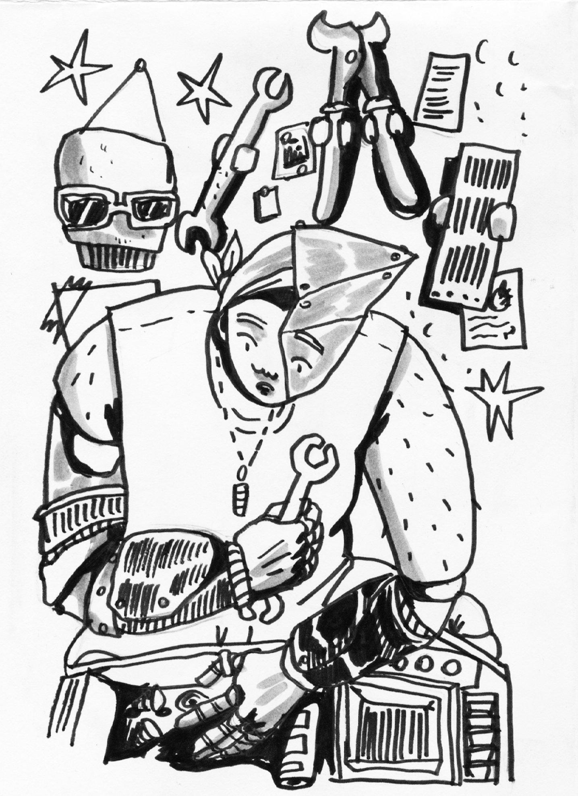
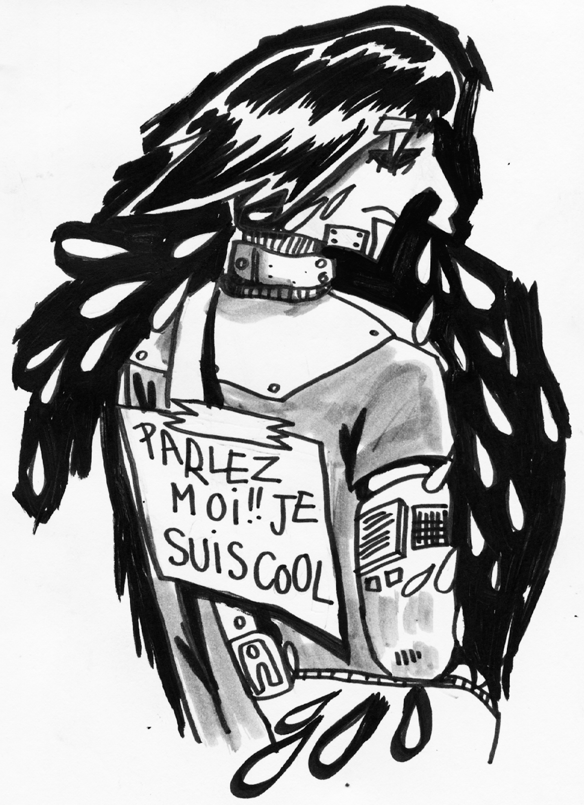
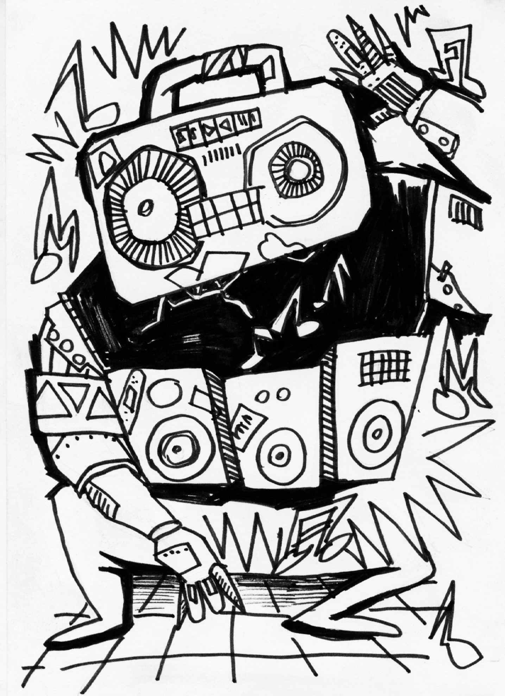
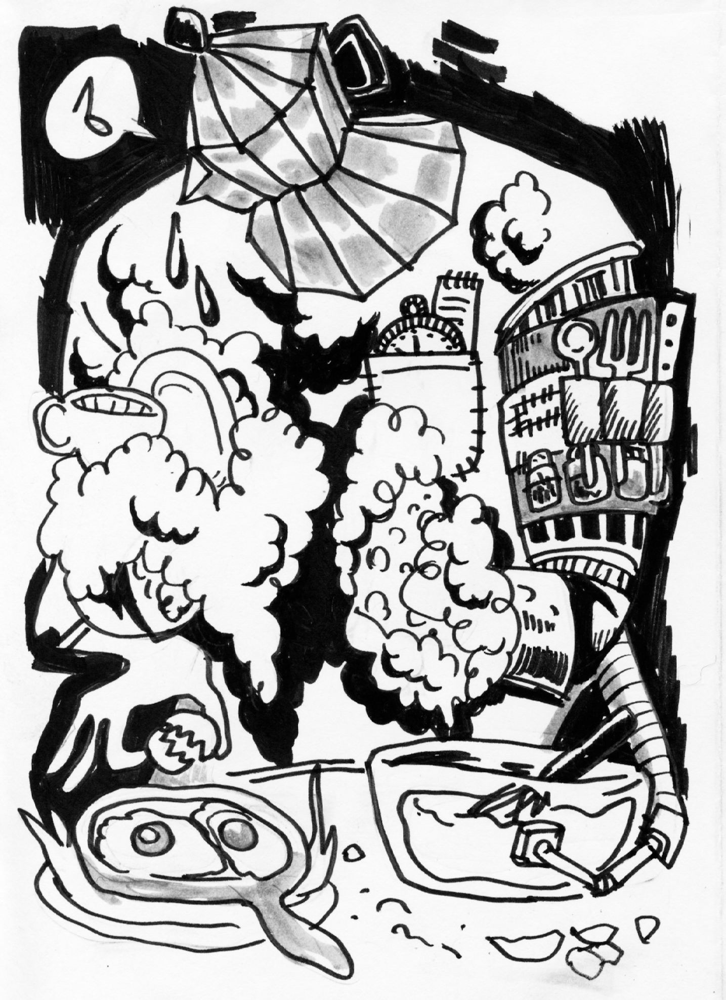
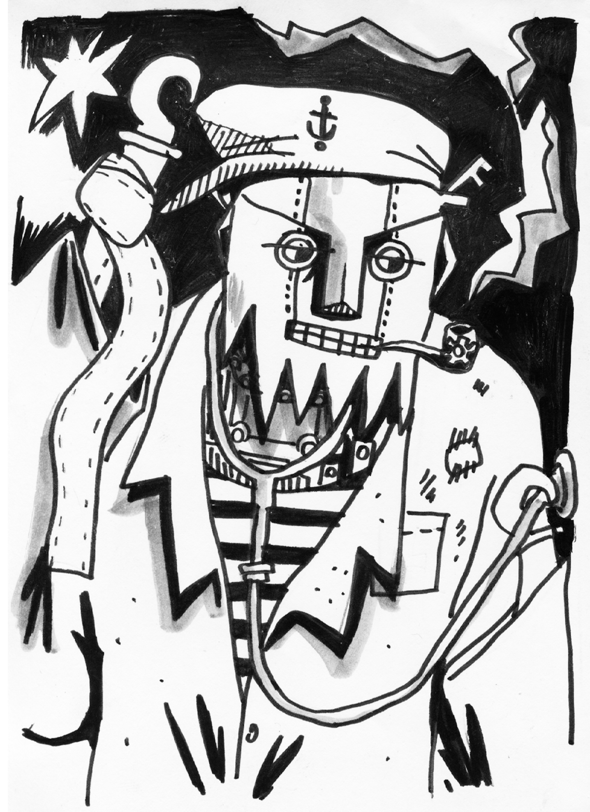
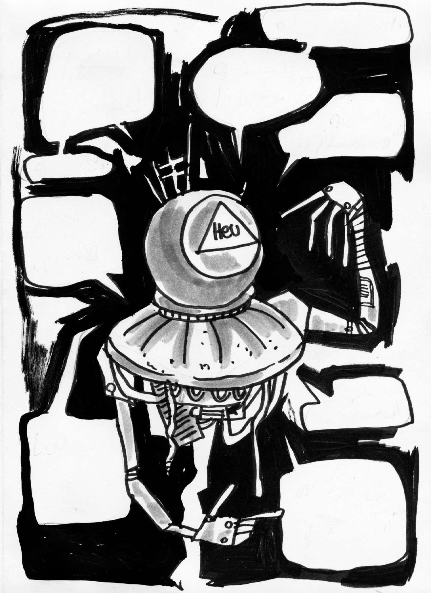
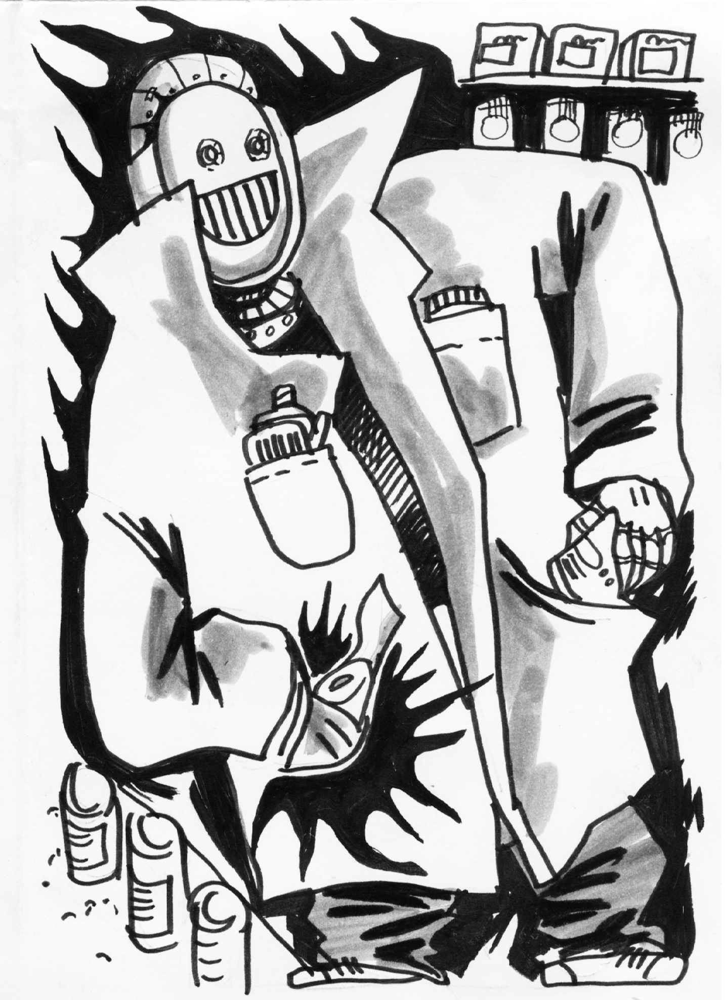

<h6>ZONE A GRABUGE</h6>

&nbsp;

<h2>2042. La gentrification a grignot&eacute; du territoire et les banlieues sont devenues des ZAG. Les mots-d'ordre sont : r&eacute;cup', DIY et THUG LIFE!!! Dans une communaut&eacute; p&eacute;riph&eacute;rique en premi&egrave;re ligne face au vieux monde surprot&eacute;g&eacute;, on tente de bidouiller des robo-trucs pour faciliter la vie, de la bamboche &agrave; la bagarre. J'te fais un petit topo de la famille?</h2>

&nbsp;

<h3>Cyberbutch :</h3>

&nbsp;

<h4>Notre M&eacute;ca-note, la plus belle, la plus forte (et la plus TDAH)! Elle fait un m&eacute;tier d'utilit&eacute; publique mais archi dangereux. Puis avec son attention al&eacute;atoire et son &eacute;nergie chaotique, de temps en temps elle se foire en installant son cric. Alors elle se rapi&egrave;ce, comme une grande; c'est comme &ccedil;a qu'elle est devenue UNE MACHINE!!! Elle &eacute;tait d&eacute;j&agrave; s&eacute;duisante mais alors l&agrave;...</h4>
<h3>&nbsp;</h3>

&nbsp;

&nbsp;

&nbsp;

&nbsp;

&nbsp;

&nbsp;

&nbsp;

&nbsp;

<h3>Emodro&iuml;de :</h3>

&nbsp;

<h4>Le robot du care, en questionnement existentiel &agrave; perp&eacute;tuit&eacute;. Son IA est r&eacute;gl&eacute;e en mode sombre et on sait pas comment le reparam&eacute;trer mais on s'est rendu compte qu'iel s'entend GIGA BIEN avec les a&iuml;euls et qu'au contact des marmots, iel brille un peu plus chaud. Alors iel se charge des soins, et fait la conversation. Comme un.e psy du turfu.</h4>

&nbsp;

&nbsp;

<h3>Roboteuf :</h3>

&nbsp;

<h4>Le king de la bamboche celui-l&agrave; ! Sa t&ecirc;te en boombox et ses projos int&eacute;gr&eacute;s font autant de bien pour all&eacute;ger les esprits apr&egrave;s une dure journ&eacute;e qu'en guise de syst&egrave;me d'alarme. Une immense star, dans nos coeurs comme dans les faits (et on est super objectifs ok?!), il est trop fun mais faut pas l'&eacute;nerver.</h4>
<h3>&nbsp;</h3>

&nbsp;

&nbsp;

&nbsp;

&nbsp;

&nbsp;

&nbsp;

&nbsp;

&nbsp;

&nbsp;

&nbsp;

<h3>I-Plonged :</h3>

&nbsp;

<h4>LA POPOTE ET LA VAISSELLE, C'EST I-PLONGED ! On ferait rien sans lui parce que c'est hyper chronophage de nourrir autant de bides mais c'est essentiel pour qu'on fonctionne, nous autres bestioles de chair et d'os. Bon, &ccedil;a nous arrive de choper la salmonelle autant que de bouffer du charbon mais 'faut bien s'nourrir de quelque chose hein.</h4>

&nbsp;

&nbsp;

<h3>Marini-ER :</h3>

&nbsp;

<h4>Ce vieux loup de mer en a vu des vertes et des pas m&ucirc;res : con&ccedil;u &agrave; partir de pi&egrave;ces ramen&eacute;es d'un port pas loin, c'est le globe-trotter de la bande. Il a des super skills de medic et nous l&acirc;che ses meilleures anecdotes d'aventures en soignant nos bobos pour pas qu'on chouine trop. Parfois on se demande, de ses mains ou ses mots, ce qui r&eacute;pare le mieux. :)</h4>

&nbsp;

&nbsp;

&nbsp;

&nbsp;

&nbsp;

&nbsp;

<h3>OkCriptik :</h3>

&nbsp;

<h4>Imagine le rejeton de Google et du Dala&iuml;-Lama. (Arr&ecirc;te de penser &agrave; Petit Bambou, c'est pas ce qu'on a dit pur&eacute;e!) On gal&egrave;re un peu &agrave; interagir avec lui, et ses r&eacute;ponses sont toujours maxi cryptiques ; peut-&ecirc;tre &agrave; cause de sa tronche de boule de billard divinatoire. Cela dit, ses m&eacute;ditations semblent l'emmener souvent jusqu'aux r&eacute;seaux des voisins, on sait pas trop ce qu'il y fait mais on a des &eacute;chos de sabotage informatique dont les timings correspondent bizarrement avec ses illuminations les plus intenses...</h4>

&nbsp;

&nbsp;

<h3>Electrochourses :</h3>

&nbsp;

<h4>C'est notre petit bandit favori! Quand les r&eacute;coltes sont mauvaises et qu'I-Plonged commence &agrave; manquer de matos, il file &agrave; toute berzingue p&eacute;ta des snacks &agrave; la lisi&egrave;re de la Zone Vieille; pour le plus grand bonheur de nos papilles et de nos esprits rebelles!</h4>

&nbsp;

&nbsp;

&nbsp;
